## Index

- [Index](#index)
- [Prerequisites](#prerequisites)
  - [Clone and run the project locally](#clone-and-run-the-project-locally)
- [Environment variables](#environment-variables)
- [Setting up AWS](#setting-up-aws)
- [Hostname mapping](#hostname-mapping)
- [Deployment flow](#deployment-flow)
- [User flow](#user-flow)
- [Admin flow](#admin-flow)
- [Postman API Collection](#postman-api-collection)
- [Collections Uses](#collections-uses)
- [API Endpoints Documentation](#api-endpoints-documentation)
    - [Query Parameters](#query-parameters)
    - [Request Example](#request-example)
    - [Endpoint Behavior](#endpoint-behavior)

## Prerequisites

- Node.js (version 18 or higher recommended, 20+ supported)
- pnpm (package manager). Install globally with `npm install -g pnpm`
- MongoDB
- AWS Account

### Clone and run the project locally

```
git clone https://github.com/TeamShiksha/openlogo.git
cd openlogo
pnpm install
pnpm start
```

## Environment variables

Most of the environment variables can be used by copying them from the `.env.example` file. However, if you are trying to run the business APIs locally, you will need some additional environment variables associated with AWS.

- Create a new `.env` file or rename `.env.example` to `.env`.

- Change  `CLIENT_URL` , `CLIENT_PROXY_URL`  to
```
CLIENT_URL=http://localhost:8080     
CLIENT_PROXY_URL=http://localhost:8080
```
- Fill your MongoDB URL (e.g., `mongodb+srv://username:<db_password>@...`) in MongoDB Compass.

- The lines inside the file `app > controller > auth.js` comment them out to fix local authentication issues.
``` 
 //  sameSite: "strict",  
 //  httpOnly: true,      
 /// domain: ".openlogo.fyi",
    comment them out. 
```
- **Frontend:** Must be running on port `8080`.
- **Backend:** Must be running on port `5000`.
- **Database:** Ensure MongoDB is connected and running.

You can now sign up as a user.  
To verify the user, check the terminal of your IDE (the verification email will not be sent to your inbox in local development).


## Admin access

now to gain admin access 

- Go to your MongoDB   `your mongodb cluster > openlogo > users`.
- Change the `role` from `CUSTOMER` to `ADMIN`.
- Update those changes.

## Setting up AWS

You should have an AWS account 

- Search **CloudFormation**
- Click on **create stack**
- Under the heading `Prepare template` select `Choose an existing template`.
- Under  the heading `specify template` select `upload a template file`.
- Create a stack using `cloudformation_dev_test.yml` file given inside `app/aws` directory.
- You can generate the private and public RSA key by following the instructions given [here](https://docs.aws.amazon.com/AmazonCloudFront/latest/DeveloperGuide/ private-content-trusted-signers.html).
- While creating or updating a stack make sure for `AllowedOriginInS3` parameter select is `http://localhost:8080` to avoid CORS error for S3 in your local development environment.
-keep everything same on the following steps.

  **NOTE**: Remember to revert it back to the stage URL before committing or deploying.

- After the stack creation is successful you can find most environmental variables under the `Output` section which are mentioned below:

  - `BUCKET_NAME`
  - `BUCKET_REGION`
  - `BUCKET_KEY`
  - `DISTRIBUTION_DOMAIN`
  - `CLOUD_FRONT_KEYPAIR_ID`
  - `ACCESS_KEY`
  - `SECRET_ACCESS_KEY`
  - `DISTRIBUTION_ID`
  -`ADMINSEMAIL`should be the email used to create `AWS`account.This is `not` present in the values you copy from `output`

    **NOTE**: These values will be comma-seperated.
    **NOTE**: Some changes in this file are manually updated in the prod. As the incremental changes trigger delete and replace, however if you are creating resources for the first time using this template then everthing should work fine.
    **NOTE**: COPY them to `.env` & Remove commas.
  `CLOUD_FRONT_PRIVATE_KEY`  - Make a variable with this name and paste your RSAPRIVATEKEY.

 You have now successfully setup  the AWS , to verify if everything is working fine signIn from the credentials which had admin access 

- Go to dashboard
- Choose admin
- Click on add image , select a `png`
- Give full URL  for example (http://google.com/)
**NOTE**: Dont forget the trailing `/`
- The image should be uploaded and reflect in your S3 bucket too.

## Hostname mapping

To ensure parity with production and staging environment it is better to have hostname mapping.

For POSIX systems, append this in your `/etc/hosts`. Make sure you have sudo priveleges while modifying the file

```sh
127.0.0.1  local.openlogo.fyi
```

For windows, modify `\etc\hosts` file located inside `System32\drivers` folder and append

```sh
127.0.0.1  local.openlogo.fyi
```

## Deployment flow


- [deploy-frontend.yaml](../../.github/workflows/deploy-frontend.yaml)
- [deploy-backend.yaml](../../.github/workflows/deploy-backend.yaml)

## User flow 
 
 
 
 
 

 ## Admin flow
 

## Postman API Collection

The Postman API collection and environment files are located in the `/docs/Postman Collection` directory. These files can be used to test the API endpoints:

`postman_collection.json`: Contains the collection of API requests for testing the Openlogo application.

`postman_environment.json`: Contains environment variables for configuring the API requests, such as base URLs and authentication tokens.

To use the Postman collection:

- Import `postman_collection.json` into Postman.
- Import `postman_environment.json` into Postman.
- Configure the environment variables in Postman from the `.env` file.
- Use the collection to test the API endpoints.

## Collections Uses

<details>
  <summary><strong>CONTACTUS</strong> – Stores user inquiries and support requests</summary>
  <table>
    <thead>
      <tr><th>Field</th><th>Type</th><th>Description</th></tr>
    </thead>
    <tbody>
      <tr><td>email</td><td>string</td><td>User's email address (required)</td></tr>
      <tr><td>name</td><td>string</td><td>Name of the user (required)</td></tr>
      <tr><td>message</td><td>string</td><td>Message or inquiry submitted by user (required)</td></tr>
      <tr><td>status</td><td>string (enum)</td><td>Status of the inquiry (e.g. PENDING)</td></tr>
      <tr><td>operator</td><td>ObjectId (ref: users)</td><td>Support operator assigned to handle the inquiry</td></tr>
      <tr><td>is_deleted</td><td>boolean</td><td>Soft delete flag</td></tr>
      <tr><td>openedAt</td><td>date</td><td>Timestamp when inquiry was opened</td></tr>
      <tr><td>closedAt</td><td>date (nullable)</td><td>Timestamp when inquiry was closed</td></tr>
      <tr><td>updated_at</td><td>date</td><td>Last update timestamp</td></tr>
      <tr><td>comment</td><td>string (optional)</td><td>Operator’s internal comments</td></tr>
    </tbody>
  </table>
</details>

<details>
  <summary><strong>IMAGES</strong> – Stores image data related to company's logo</summary>
  <table>
    <thead>
      <tr><th>Field</th><th>Type</th><th>Description</th></tr>
    </thead>
    <tbody>
      <tr><td>user_id</td><td>string</td><td>ID of the user who uploaded the image (required)</td></tr>
      <tr><td>company_name</td><td>string</td><td>Name of the company associated with the image (required)</td></tr>
      <tr><td>company_uri</td><td>string</td><td>URI related to the company (required)</td></tr>
      <tr><td>image_size</td><td>number</td><td>Size of the image in bytes (required)</td></tr>
      <tr><td>is_deleted</td><td>boolean</td><td>Soft delete flag</td></tr>
      <tr><td>updated_at</td><td>date</td><td>Last updated timestamp</td></tr>
      <tr><td>extension</td><td>string</td><td>File extension of the image (required)</td></tr>
    </tbody>
  </table>
</details>

<details>
  <summary><strong>KEYS</strong> – Manages API keys associated with user accounts</summary>
  <table>
    <thead>
      <tr><th>Field</th><th>Type</th><th>Description</th></tr>
    </thead>
    <tbody>
      <tr><td>_id</td><td>ObjectId</td><td>Unique identifier for the API key</td></tr>
      <tr><td>api_key</td><td>string (hashed)</td><td>API key string (auto-generated)</td></tr>
      <tr><td>key_description</td><td>string</td><td>Description or label for the API key (required)</td></tr>
      <tr><td>subscription_id</td><td>ObjectId (ref: subscriptions)</td><td>Subscription associated with the key</td></tr>
      <tr><td>expires_at</td><td>date</td><td>Expiration timestamp for the API key</td></tr>
      <tr><td>updated_at</td><td>date</td><td>Last updated timestamp</td></tr>
      <tr><td>__v</td><td>number</td><td>Mongoose version key (internal)</td></tr>
    </tbody>
  </table>
</details>

<details>
  <summary><strong>REQUEST</strong> – Stores user requests related to companies</summary>
  <table>
    <thead>
      <tr><th>Field</th><th>Type</th><th>Description</th></tr>
    </thead>
    <tbody>
      <tr><td>user_id</td><td>ObjectId (ref: users)</td><td>User who submitted the request (required)</td></tr>
      <tr><td>companyUrl</td><td>string (URL)</td><td>Company URL (validated) (required)</td></tr>
      <tr><td>status</td><td>string (enum)</td><td>Status of the request (default: PENDING)</td></tr>
      <tr><td>operator</td><td>ObjectId (ref: users)</td><td>Assigned operator handling the request</td></tr>
      <tr><td>comment</td><td>string (optional)</td><td>Internal comments by operator</td></tr>
      <tr><td>openedAt</td><td>date</td><td>Timestamp when request was opened</td></tr>
      <tr><td>closedAt</td><td>date (nullable)</td><td>Timestamp when request was closed</td></tr>
      <tr><td>updated_at</td><td>date</td><td>Last updated timestamp</td></tr>
    </tbody>
  </table>
</details>

<details>
  <summary><strong>SUBSCRIPTIONS</strong> – Stores user subscription data and usage limits</summary>
  <table>
    <thead>
      <tr><th>Field</th><th>Type</th><th>Description</th></tr>
    </thead>
    <tbody>
      <tr><td>type</td><td>string (enum)</td><td>Subscription type (required)</td></tr>
      <tr><td>key_limit</td><td>number</td><td>Maximum allowed API keys (required)</td></tr>
      <tr><td>usage_limit</td><td>number</td><td>Maximum allowed usage count (required)</td></tr>
      <tr><td>usage_count</td><td>number</td><td>Current usage count (default: 0)</td></tr>
      <tr><td>is_active</td><td>boolean</td><td>Whether subscription is active (required)</td></tr>
      <tr><td>payment</td><td>string (optional)</td><td>Payment info or transaction reference</td></tr>
      <tr><td>updated_at</td><td>date</td><td>Last updated timestamp</td></tr>
    </tbody>
  </table>
</details>

<details>
  <summary><strong>USERS</strong> – Manages user accounts, authentication, and profiles</summary>
  <table>
    <thead>
      <tr><th>Field</th><th>Type</th><th>Description</th></tr>
    </thead>
    <tbody>
      <tr><td>email</td><td>string (unique)</td><td>User email for login (required)</td></tr>
      <tr><td>name</td><td>string</td><td>User full name (required)</td></tr>
      <tr><td>password</td><td>string (hashed)</td><td>User password (required)</td></tr>
      <tr><td>role</td><td>string (enum)</td><td>User role, e.g., CUSTOMER (default)</td></tr>
      <tr><td>is_verified</td><td>boolean</td><td>Email verification status (default: false)</td></tr>
      <tr><td>subscription_id</td><td>ObjectId (ref: subscriptions)</td><td>Reference to user subscription</td></tr>
      <tr><td>keys</td><td>Array of ObjectId (ref: keys)</td><td>API keys linked to user</td></tr>
      <tr><td>is_deleted</td><td>boolean</td><td>Soft delete flag</td></tr>
      <tr><td>updated_at</td><td>date</td><td>Last update timestamp</td></tr>
      <tr><td>forgot_password_attempts</td><td>number</td><td>Number of password reset attempts made by the user</td></tr>
      <tr><td>forgot_password_last_reset_at</td><td>date</td><td>Timestamp of the last successful password reset (null if never reset)</td></tr>
      <tr><td>reward_points_current</td><td>number (default: 0)</td><td>Current redeemable reward points earned by the user</td></tr>
      <tr><td>reward_points_lifetime</td><td>number (default: 0)</td><td>All-time reward points ever earned by the user (never decreases)</td></tr>
      <tr><td>deleted_at</td><td>date (nullable)</td><td>Timestamp when the user was soft-deleted</td></tr>
      <tr><td>mfaEnabled</td><td>boolean (default: false)</td><td>Whether multi-factor authentication is enabled</td></tr>
      <tr><td>mfaSecret</td><td>object (encrypted)</td><td>Encrypted MFA secret <code>{ encryptedValue, encryptedIv, encryptedTag }</code></td></tr>
      <tr><td>mfaTempSecret</td><td>string (nullable)</td><td>Temporary MFA secret during enrollment</td></tr>
      <tr><td>mfaTempSecretExpiresAt</td><td>date (nullable)</td><td>Expiration time of the temporary MFA secret</td></tr>
    </tbody>
  </table>
</details>

<details>
  <summary><strong>USERTOKENS</strong> – Stores tokens for authentication and password reset</summary>
  <table>
    <thead>
      <tr><th>Field</th><th>Type</th><th>Description</th></tr>
    </thead>
    <tbody>
      <tr><td>token</td><td>string</td><td>Unique token string (auto-generated)</td></tr>
      <tr><td>user_id</td><td>string</td><td>ID of the user associated with the token</td></tr>
      <tr><td>type</td><td>string (enum)</td><td>Type of token (FORGOT, VERIFY)</td></tr>
      <tr><td>is_deleted</td><td>boolean</td><td>Soft delete flag</td></tr>
      <tr><td>expire_at</td><td>date</td><td>Expiration timestamp (default 1 day after creation)</td></tr>
    </tbody>
  </table>
</details>

<details>
  <summary><strong>LOGO_REQUESTS_LOGS</strong> – Lightweight records for tracking logo requests over time</summary>
  <table>
    <thead>
      <tr><th>Field</th><th>Type</th><th>Description</th></tr>
    </thead>
    <tbody>
      <tr><td>user_id</td><td>ObjectId (ref: users)</td><td>User who made the Logo request (required)</td></tr>
      <tr><td>key_id</td><td>ObjectId (ref: keys)</td><td>API key used for the request (optional)</td></tr>
      <tr><td>image_id</td><td>ObjectId (ref: images)</td><td>Logo/image accessed via the API request (required)</td></tr>
      <tr><td>response_size_bytes</td><td>number</td><td>Size of the response in bytes (default: 0)</td></tr>
      <tr><td>createdAt</td><td>date</td><td>Timestamp when request was made (auto-generated)</td></tr>
      <tr><td>updatedAt</td><td>date</td><td>Last updated timestamp (auto-generated)</td></tr>
    </tbody>
  </table>
</details>

<details>
  <summary><strong>REWARDS</strong> – Tracks reward progress per logo including milestones and points</summary>
  <table>
    <thead>
      <tr><th>Field</th><th>Type</th><th>Description</th></tr>
    </thead>
    <tbody>
      <tr><td>image_id</td><td>ObjectId (ref: images, unique)</td><td>Logo/image this reward record belongs to (required)</td></tr>
      <tr><td>user_id</td><td>ObjectId (ref: users)</td><td>Creator who uploaded the image (required)</td></tr>
      <tr><td>unique_pro_users</td><td>Array of ObjectId (ref: users)</td><td>Unique Pro users who accessed this image via API</td></tr>
      <tr><td>unique_pro_users_count</td><td>number (default: 0)</td><td>Running count of unique Pro users</td></tr>
      <tr><td>milestones_achieved</td><td>array</td><td>List of milestones: <code>[{ milestone, achieved_at, points_awarded }]</code></td></tr>
      <tr><td>total_points_awarded</td><td>number (default: 0)</td><td>Cumulative points awarded for this image</td></tr>
      <tr><td>createdAt</td><td>date</td><td>Auto-generated timestamp</td></tr>
      <tr><td>updatedAt</td><td>date</td><td>Last updated timestamp</td></tr>
    </tbody>
  </table>
</details>

<details>
  <summary><strong>REWARD_TRANSACTIONS</strong> – Immutable audit log for all reward changes</summary>
  <table>
    <thead>
      <tr><th>Field</th><th>Type</th><th>Description</th></tr>
    </thead>
    <tbody>
      <tr><td>image_id</td><td>ObjectId (ref: images, nullable)</td><td>Logo/image associated with this transaction</td></tr>
      <tr><td>user_id</td><td>ObjectId (ref: users)</td><td>Creator who received/reversed the reward (required)</td></tr>
      <tr><td>transaction_type</td><td>string (enum)</td><td>Type: <code>MILESTONE_REWARD</code>, <code>MANUAL_ADJUSTMENT</code>, <code>REVERSAL</code>, or <code>BONUS</code> (required)</td></tr>
      <tr><td>milestone</td><td>number (nullable)</td><td>Milestone threshold that triggered this transaction</td></tr>
      <tr><td>points_awarded</td><td>number</td><td>Points awarded in this transaction (required)</td></tr>
      <tr><td>points_reversed</td><td>number (default: 0)</td><td>Points reversed (for REVERSAL transactions)</td></tr>
      <tr><td>description</td><td>string (nullable)</td><td>Human-readable description of the transaction</td></tr>
      <tr><td>reason</td><td>string (enum, nullable)</td><td>Reason: <code>NORMAL_MILESTONE</code>, <code>DUPLICATE_REMOVAL</code>, <code>SUSPICIOUS_ACTIVITY</code>, <code>MANUAL_CORRECTION</code>, <code>PROMOTION</code>, or <code>SYSTEM_ERROR</code></td></tr>
      <tr><td>previous_total</td><td>number</td><td>User's total points before this transaction (required)</td></tr>
      <tr><td>new_total</td><td>number</td><td>User's total points after this transaction (required)</td></tr>
      <tr><td>is_reversed</td><td>boolean (default: false)</td><td>Whether this transaction has been reversed</td></tr>
      <tr><td>reversed_at</td><td>date (nullable)</td><td>Timestamp when the transaction was reversed</td></tr>
      <tr><td>reversed_by</td><td>ObjectId (ref: users, nullable)</td><td>Admin who reversed the transaction</td></tr>
      <tr><td>reversal_reason</td><td>string (nullable)</td><td>Reason provided for the reversal</td></tr>
      <tr><td>metadata</td><td>object (Mixed)</td><td>Flexible metadata (e.g., <code>{ unique_pro_users_count, processed_at }</code>)</td></tr>
      <tr><td>createdAt</td><td>date</td><td>Auto-generated timestamp</td></tr>
      <tr><td>updatedAt</td><td>date</td><td>Last updated timestamp</td></tr>
    </tbody>
  </table>
</details>

<details>
  <summary><strong>MILESTONE_CONFIGS</strong> – Admin-managed milestone thresholds and point values</summary>
  <table>
    <thead>
      <tr><th>Field</th><th>Type</th><th>Description</th></tr>
    </thead>
    <tbody>
      <tr><td>name</td><td>string</td><td>Human-readable label for this config (required)</td></tr>
      <tr><td>thresholds</td><td>array</td><td>Milestone definitions: <code>[{ at: number, points: number }]</code> — each entry defines the unique Pro user count and points awarded when crossed (required, non-empty)</td></tr>
      <tr><td>is_active</td><td>boolean (default: false)</td><td>Whether this config is currently active (only one may be active at a time)</td></tr>
      <tr><td>is_deleted</td><td>boolean (default: false)</td><td>Soft-delete flag</td></tr>
      <tr><td>created_by</td><td>ObjectId (ref: users)</td><td>Admin who created this config (required)</td></tr>
      <tr><td>createdAt</td><td>date</td><td>Auto-generated timestamp</td></tr>
      <tr><td>updatedAt</td><td>date</td><td>Last updated timestamp</td></tr>
    </tbody>
  </table>
</details>

<details>
  <summary><strong>SUBSCRIPTION_LOGS</strong> – Audit trail for subscription plan changes</summary>
  <table>
    <thead>
      <tr><th>Field</th><th>Type</th><th>Description</th></tr>
    </thead>
    <tbody>
      <tr><td>user_id</td><td>ObjectId (ref: users)</td><td>User whose subscription was changed (required)</td></tr>
      <tr><td>subscription_id</td><td>ObjectId (ref: subscriptions)</td><td>Subscription document affected (required)</td></tr>
      <tr><td>changed_by</td><td>ObjectId (ref: users)</td><td>Admin who performed the change (required)</td></tr>
      <tr><td>from_plan</td><td>string (enum)</td><td>Previous plan: <code>HOBBY</code>, <code>PRO</code>, or <code>TEAMS</code> (required)</td></tr>
      <tr><td>to_plan</td><td>string (enum)</td><td>New plan: <code>HOBBY</code>, <code>PRO</code>, or <code>TEAMS</code> (required)</td></tr>
      <tr><td>reason</td><td>string (optional)</td><td>Optional note explaining the change</td></tr>
      <tr><td>createdAt</td><td>date</td><td>Auto-generated timestamp</td></tr>
      <tr><td>updatedAt</td><td>date</td><td>Last updated timestamp</td></tr>
    </tbody>
  </table>
</details>

## API Endpoints Documentation

<details>
<summary>AUTH</summary>

| URL            | Method | Auth Required | Description         |
| -------------- | ------ | ------------- | ------------------- |
| `/auth/signup` | POST   | False         | Register a new user |

> <details>
> <summary>Request body</summary>
>
> ```json
> {
>   "name": "Arjun Sharma",
>   "email": "arjunsharma@gmail.com",
>   "password": "securePassword@123",
>   "confirmPassword": "securePassword@123"
> }
> ```
>
> </details>
>
> <details>
> <summary>Response body</summary>
>
> ```json
> {
>   "statusCode": 200
> }
> ```
>
> **Response:** `200 OK` - User registered successfully</br> > **Response:** `400 Bad Request` - Invalid input data</br> > **Response:** `409 Conflict` - Email already exists
>
> </details>

<details>
<summary>Api Flow diagram</summary>

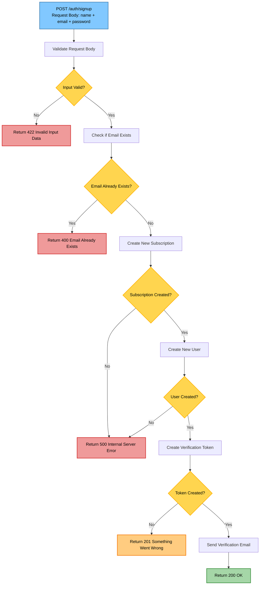
```mermaid
flowchart TD
%% API Flow: POST /auth/signup
Start[POST /auth/signup<br/>Request Body: name + email + password] --> ValidateInput[Validate Request Body]

ValidateInput --> InputValid{Input Valid?}
InputValid -->|No| Input422[Return 422 Invalid Input Data]
InputValid -->|Yes| CheckEmail[Check if Email Exists]

CheckEmail --> EmailExists{Email Already Exists?}
EmailExists -->|Yes| Email400[Return 400 Email Already Exists]
EmailExists -->|No| CreateSubscription[Create New Subscription]

CreateSubscription --> SubCreated{Subscription Created?}
SubCreated -->|No| Server500[Return 500 Internal Server Error]
SubCreated -->|Yes| CreateUser[Create New User]

CreateUser --> UserCreated{User Created?}
UserCreated -->|No| Server500
UserCreated -->|Yes| CreateToken[Create Verification Token]

CreateToken --> TokenCreated{Token Created?}
TokenCreated -->|No| Success201[Return 201 Something Went Wrong]
TokenCreated -->|Yes| SendEmail[Send Verification Email]

SendEmail --> Success200[Return 200 OK]

classDef startEnd fill:#81C8FF,stroke:#4682B4,stroke-width:2px,color:#000;
classDef decision fill:#FFD54F,stroke:#FFB300,stroke-width:2px,color:#000;
classDef success fill:#A5D6A7,stroke:#388E3C,stroke-width:2px,color:#000;
classDef error fill:#EF9A9A,stroke:#D32F2F,stroke-width:2px,color:#000;
classDef warning fill:#FFCC80,stroke:#F57C00,stroke-width:2px,color:#000;

class Start,Success200 startEnd
class InputValid,EmailExists,SubCreated,UserCreated,TokenCreated decision
class Success200 success
class Input422,Email400,Server500 error
class Success201 warning

```

</details>

---

| URL            | Method | Auth Required | Description                |
| -------------- | ------ | ------------- | -------------------------- |
| `/auth/signin` | POST   | False         | Log in and start a session |

> <details>
> <summary>Request body</summary>
>
> ```json
> {
>   "email": "arjunsharma@gmail.com",
>   "password": "securePassword@123"
> }
> ```
>
> </details>
>
> <details>
> <summary>Response body</summary>
>
> ```json
> {
>   "statusCode": 200
> }
> ```
>
> **Response:** `200 OK` - Login successful</br> > **Response:** `401 Unauthorized` - Invalid credentials</br> > **Response:** `400 Bad Request` - Invalid input data
>
> </details>

<details>
<summary>Api Flow diagram</summary>

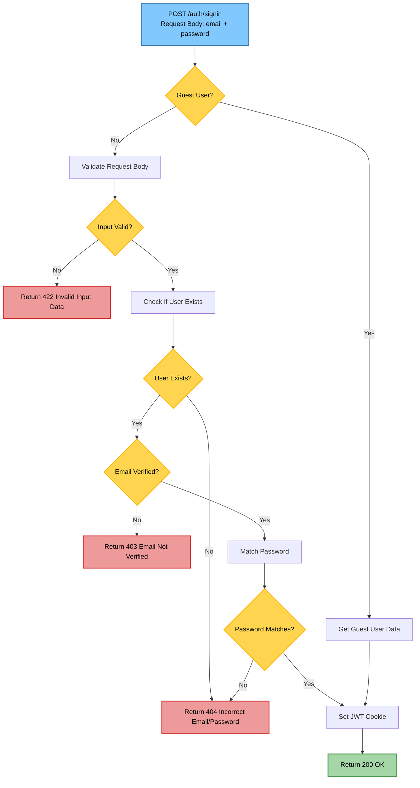
```mermaid
flowchart TD
%% API Flow: POST /auth/signin
Start[POST /auth/signin<br/>Request Body: email + password] --> GuestCheck{Guest User?}

GuestCheck -->|Yes| GetGuestUser[Get Guest User Data]
GuestCheck -->|No| ValidateInput[Validate Request Body]

ValidateInput --> InputValid{Input Valid?}
InputValid -->|No| Input422[Return 422 Invalid Input Data]
InputValid -->|Yes| CheckUser[Check if User Exists]

CheckUser --> UserExists{User Exists?}
UserExists -->|No| User404[Return 404 Incorrect Email/Password]
UserExists -->|Yes| CheckVerified{Email Verified?}

CheckVerified -->|No| Verify403[Return 403 Email Not Verified]
CheckVerified -->|Yes| VerifyPassword[Match Password]

VerifyPassword --> PasswordMatch{Password Matches?}
PasswordMatch -->|No| User404
PasswordMatch -->|Yes| SetCookie[Set JWT Cookie]

GetGuestUser --> SetCookie
SetCookie --> Success200[Return 200 OK]

classDef startEnd fill:#81C8FF,stroke:#4682B4,stroke-width:2px,color:#000;
classDef decision fill:#FFD54F,stroke:#FFB300,stroke-width:2px,color:#000;
classDef success fill:#A5D6A7,stroke:#388E3C,stroke-width:2px,color:#000;
classDef error fill:#EF9A9A,stroke:#D32F2F,stroke-width:2px,color:#000;
classDef warning fill:#FFCC80,stroke:#F57C00,stroke-width:2px,color:#000;

class Start,Success200 startEnd
class GuestCheck,InputValid,UserExists,CheckVerified,PasswordMatch decision
class Success200 success
class Input422,User404,Verify403 error

```

</details>

---

| URL             | Method | Auth Required | Description           |
| --------------- | ------ | ------------- | --------------------- |
| `/auth/signout` | POST   | True          | Terminate the session |

> <details>
> <summary>Response body</summary>
>
> ```json
> {
>   "message": "Logged out successfully",
>   "success": true
> }
> ```
>
> **Response:** `200 OK` - Logout successful</br> > **Response:** `401 Unauthorized` - Not authenticated
>
> </details>

<details>
<summary>Api Flow diagram</summary>

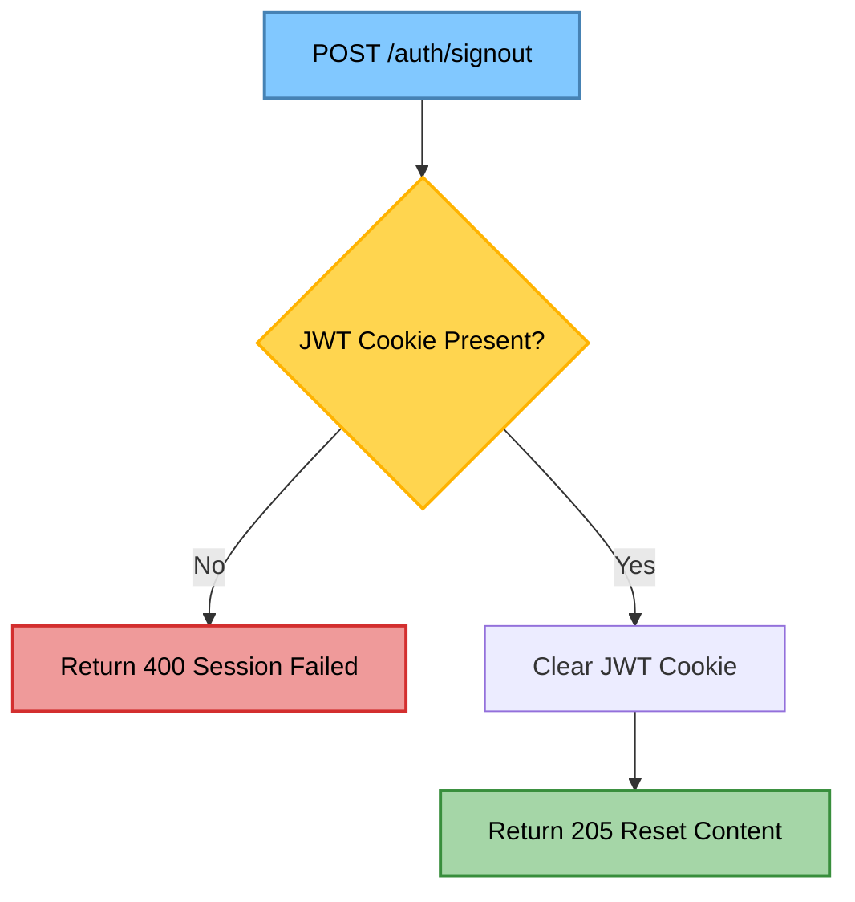
```mermaid
flowchart TD
%% API Flow: POST /auth/signout
Start[POST /auth/signout] --> CheckCookie{JWT Cookie Present?}

CheckCookie -->|No| Cookie400[Return 400 Session Failed]
CheckCookie -->|Yes| ClearCookie[Clear JWT Cookie]

ClearCookie --> Success205[Return 205 Reset Content]

classDef startEnd fill:#81C8FF,stroke:#4682B4,stroke-width:2px,color:#000;
classDef decision fill:#FFD54F,stroke:#FFB300,stroke-width:2px,color:#000;
classDef success fill:#A5D6A7,stroke:#388E3C,stroke-width:2px,color:#000;
classDef error fill:#EF9A9A,stroke:#D32F2F,stroke-width:2px,color:#000;
classDef warning fill:#FFCC80,stroke:#F57C00,stroke-width:2px,color:#000;

class Start,Success205 startEnd
class CheckCookie decision
class Success205 success
class Cookie400 error
```

</details>

---

| URL                    | Method | Auth Required | Description                                     |
| ---------------------- | ------ | ------------- | ----------------------------------------------- |
| `/auth/verify/:token?` | GET    | False         | Validate the user session token or verify email |

> <details>
> <summary>Response body</summary>
>
> ```json
> {
>   "statusCode": 200
> }
> ```
>
> **Response:** `200 OK` - Token valid or email verified</br> > **Response:** `400 Bad Request` - Invalid token</br> > **Response:** `401 Unauthorized` - Invalid session
>
> </details>

<details>
<summary>Api Flow diagram</summary>

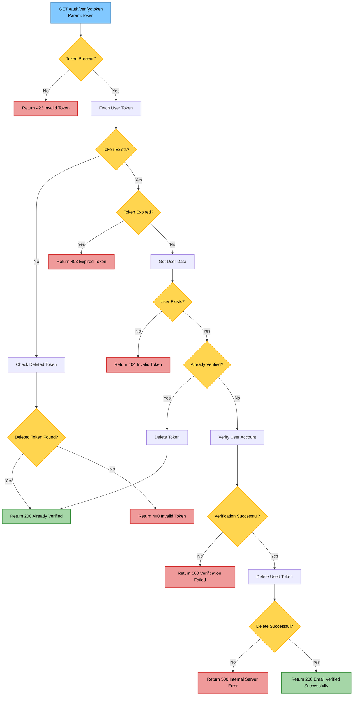
```mermaid
flowchart TD
%% API Flow: GET /auth/verify/:token
Start[GET /auth/verify/:token<br/>Param: token] --> ValidateToken{Token Present?}

ValidateToken -->|No| Token422[Return 422 Invalid Token]
ValidateToken -->|Yes| FetchToken[Fetch User Token]

FetchToken --> TokenExists{Token Exists?}
TokenExists -->|No| CheckDeleted[Check Deleted Token]
TokenExists -->|Yes| CheckExpiry{Token Expired?}

CheckDeleted --> DeletedExists{Deleted Token Found?}
DeletedExists -->|Yes| Already200[Return 200 Already Verified]
DeletedExists -->|No| Token400[Return 400 Invalid Token]

CheckExpiry -->|Yes| Expired403[Return 403 Expired Token]
CheckExpiry -->|No| GetUser[Get User Data]

GetUser --> UserExists{User Exists?}
UserExists -->|No| User404[Return 404 Invalid Token]
UserExists -->|Yes| AlreadyVerified{Already Verified?}

AlreadyVerified -->|Yes| DeleteToken[Delete Token]
DeleteToken --> Already200
AlreadyVerified -->|No| VerifyUser[Verify User Account]

VerifyUser --> VerifySuccess{Verification Successful?}
VerifySuccess -->|No| Verify500[Return 500 Verification Failed]
VerifySuccess -->|Yes| DeleteTokenSuccess[Delete Used Token]

DeleteTokenSuccess --> DeleteSuccess{Delete Successful?}
DeleteSuccess -->|No| Server500[Return 500 Internal Server Error]
DeleteSuccess -->|Yes| Success200[Return 200 Email Verified Successfully]

classDef startEnd fill:#81C8FF,stroke:#4682B4,stroke-width:2px,color:#000;
classDef decision fill:#FFD54F,stroke:#FFB300,stroke-width:2px,color:#000;
classDef success fill:#A5D6A7,stroke:#388E3C,stroke-width:2px,color:#000;
classDef error fill:#EF9A9A,stroke:#D32F2F,stroke-width:2px,color:#000;
classDef warning fill:#FFCC80,stroke:#F57C00,stroke-width:2px,color:#000;

class Start,Success200,Already200 startEnd
class ValidateToken,TokenExists,DeletedExists,CheckExpiry,UserExists,AlreadyVerified,VerifySuccess,DeleteSuccess decision
class Success200,Already200 success
class Token422,Token400,Expired403,User404,Verify500,Server500 error

```

</details>

---

| URL                     | Method | Auth Required | Description                |
| ----------------------- | ------ | ------------- | -------------------------- |
| `/auth/password/forgot` | POST   | False         | Initiate password recovery |

> <details>
> <summary>Request body</summary>
>
> ```json
> {
>   "email": "user@example.com"
> }
> ```
>
> </details>
>
> <details>
> <summary>Response body</summary>
>
> ```json
> {
>   "statusCode": 200
> }
> ```
>
> **Response:** `200 OK` - Password reset email sent</br> > **Response:** `400 Bad Request` - Invalid email</br> > **Response:** `404 Not Found` - Email not found
>
> </details>

<details>
<summary>Api Flow diagram</summary>

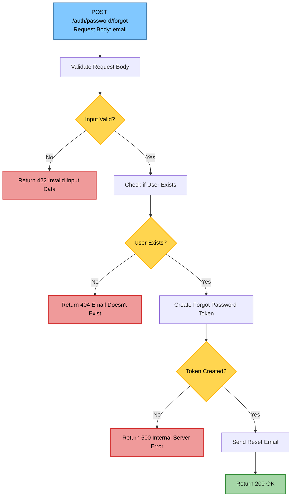
```mermaid

flowchart TD
%% API Flow: POST /auth/password/forgot
Start[POST /auth/password/forgot<br/>Request Body: email] --> ValidateInput[Validate Request Body]

ValidateInput --> InputValid{Input Valid?}
InputValid -->|No| Input422[Return 422 Invalid Input Data]
InputValid -->|Yes| CheckUser[Check if User Exists]

CheckUser --> UserExists{User Exists?}
UserExists -->|No| User404[Return 404 Email Doesn't Exist]
UserExists -->|Yes| CreateToken[Create Forgot Password Token]

CreateToken --> TokenCreated{Token Created?}
TokenCreated -->|No| Server500[Return 500 Internal Server Error]
TokenCreated -->|Yes| SendEmail[Send Reset Email]

SendEmail --> Success200[Return 200 OK]

classDef startEnd fill:#81C8FF,stroke:#4682B4,stroke-width:2px,color:#000;
classDef decision fill:#FFD54F,stroke:#FFB300,stroke-width:2px,color:#000;
classDef success fill:#A5D6A7,stroke:#388E3C,stroke-width:2px,color:#000;
classDef error fill:#EF9A9A,stroke:#D32F2F,stroke-width:2px,color:#000;
classDef warning fill:#FFCC80,stroke:#F57C00,stroke-width:2px,color:#000;

class Start,Success200 startEnd
class InputValid,UserExists,TokenCreated decision
class Success200 success
class Input422,User404,Server500 error

```

</details>

---

| URL                             | Method | Auth Required | Description                |
| ------------------------------- | ------ | ------------- | -------------------------- |
| `/auth/password/forgot/:token?` | GET    | False         | Get password reset session |

> <details>
> <summary>Response body</summary>
>
> ```json
> {
>   "statusCode": 200
> }
> ```
>
> **Response:** `200 OK` - Token valid</br> > **Response:** `400 Bad Request` - Invalid token</br> > **Response:** `401 Unauthorized` - Token expired
>
> </details>

<details>
<summary>Api Flow diagram</summary>

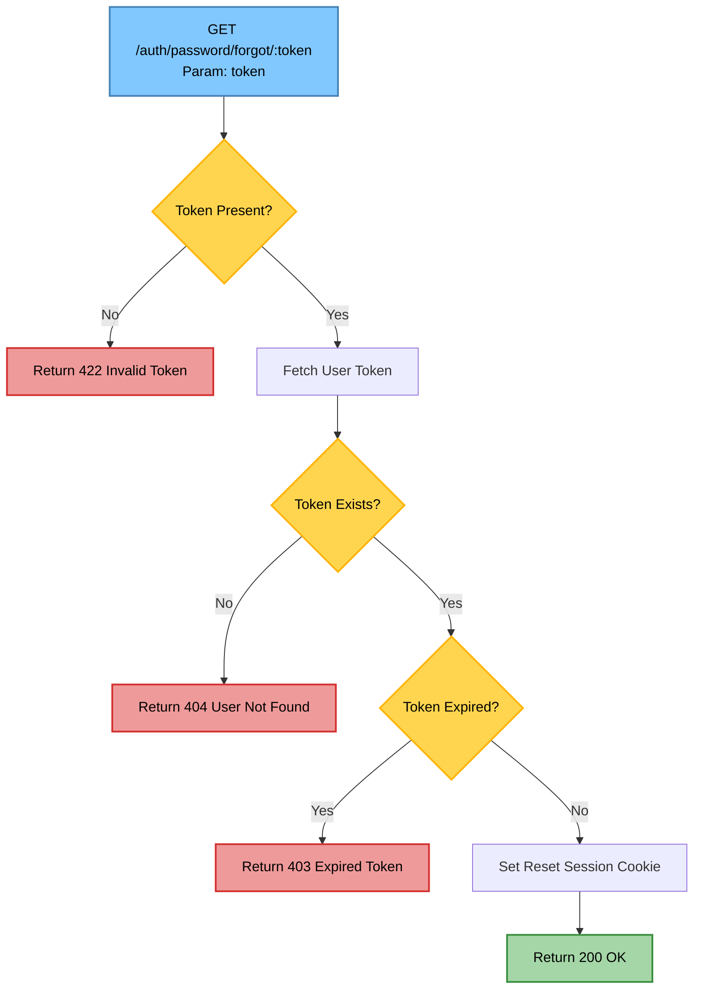
```mermaid

flowchart TD
%% API Flow: GET /auth/password/forgot/:token
Start[GET /auth/password/forgot/:token<br/>Param: token] --> ValidateToken{Token Present?}

ValidateToken -->|No| Token422[Return 422 Invalid Token]
ValidateToken -->|Yes| FetchToken[Fetch User Token]

FetchToken --> TokenExists{Token Exists?}
TokenExists -->|No| User404[Return 404 User Not Found]
TokenExists -->|Yes| CheckExpiry{Token Expired?}

CheckExpiry -->|Yes| Expired403[Return 403 Expired Token]
CheckExpiry -->|No| SetCookie[Set Reset Session Cookie]

SetCookie --> Success200[Return 200 OK]

classDef startEnd fill:#81C8FF,stroke:#4682B4,stroke-width:2px,color:#000;
classDef decision fill:#FFD54F,stroke:#FFB300,stroke-width:2px,color:#000;
classDef success fill:#A5D6A7,stroke:#388E3C,stroke-width:2px,color:#000;
classDef error fill:#EF9A9A,stroke:#D32F2F,stroke-width:2px,color:#000;
classDef warning fill:#FFCC80,stroke:#F57C00,stroke-width:2px,color:#000;

class Start,Success200 startEnd
class ValidateToken,TokenExists,CheckExpiry decision
class Success200 success
class Token422,User404,Expired403 error

```

</details>

---

| URL                    | Method | Auth Required | Description         |
| ---------------------- | ------ | ------------- | ------------------- |
| `/auth/password/reset` | PATCH  | False         | Reset user password |

> <details>
> <summary>Request body</summary>
>
> ```json
> {
>   "token": "resetToken123",
>   "newPassword": "newSecurePassword@123",
>   "confirmPassword": "newSecurePassword@123"
> }
> ```
>
> </details>
>
> <details>
> <summary>Response body</summary>
>
> ```json
> {
>   "statusCode": 200
> }
> ```
>
> **Response:** `200 OK` - Password reset successful</br> > **Response:** `400 Bad Request` - Invalid input data</br> > **Response:** `401 Unauthorized` - Invalid or expired token
>
> </details>

<details>
<summary>Api Flow diagram</summary>

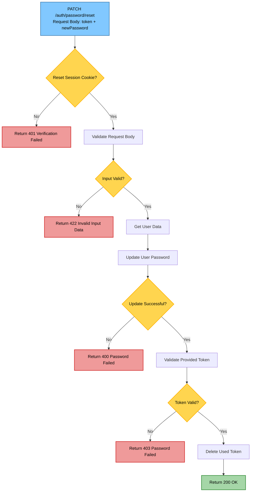
```mermaid
flowchart TD
%% API Flow: PATCH /auth/password/reset
Start[PATCH /auth/password/reset<br/>Request Body: token + newPassword] --> CheckSession{Reset Session Cookie?}

CheckSession -->|No| Session401[Return 401 Verification Failed]
CheckSession -->|Yes| ValidateInput[Validate Request Body]

ValidateInput --> InputValid{Input Valid?}
InputValid -->|No| Input422[Return 422 Invalid Input Data]
InputValid -->|Yes| GetUser[Get User Data]

GetUser --> UpdatePassword[Update User Password]
UpdatePassword --> UpdateSuccess{Update Successful?}

UpdateSuccess -->|No| Password400[Return 400 Password Failed]
UpdateSuccess -->|Yes| ValidateToken[Validate Provided Token]

ValidateToken --> TokenValid{Token Valid?}
TokenValid -->|No| Token403[Return 403 Password Failed]
TokenValid -->|Yes| DeleteToken[Delete Used Token]

DeleteToken --> Success200[Return 200 OK]

classDef startEnd fill:#81C8FF,stroke:#4682B4,stroke-width:2px,color:#000;
classDef decision fill:#FFD54F,stroke:#FFB300,stroke-width:2px,color:#000;
classDef success fill:#A5D6A7,stroke:#388E3C,stroke-width:2px,color:#000;
classDef error fill:#EF9A9A,stroke:#D32F2F,stroke-width:2px,color:#000;
classDef warning fill:#FFCC80,stroke:#F57C00,stroke-width:2px,color:#000;

class Start,Success200 startEnd
class CheckSession,InputValid,UpdateSuccess,TokenValid decision
class Success200 success
class Session401,Input422,Password400,Token403 error

```

</details>

---

| URL                               | Method | Auth Required | Description                  |
| --------------------------------- | ------ | ------------- | ---------------------------- |
| `/auth/password/validate-session` | GET    | False         | Validate user session cookie |

> <details>
> <summary>Response body</summary>
>
> ```json
> {
>   "statusCode": 200,
>   "userData": {
>     "name": "john",
>     "email": "johndoe@example.com",
>     "role": "ADMIN",
>     "is_verified": true,
>     "subscription_id": "6850237718e51707367387bd",
>     "userId": "6850237718e51707367387bf",
>     "created_at": "2025-06-16T14:00:23.000Z",
>     "is_deleted": false,
>     "updated_at": "2025-06-16T14:00:23.183Z"
>   }
> }
> ```
>
> **Response:** `200 OK` - successfully Validated</br> > **Response:** `401 Unauthorized` - Invalid Credentials
>
> </details>

<details>
<summary>Api Flow diagram</summary>

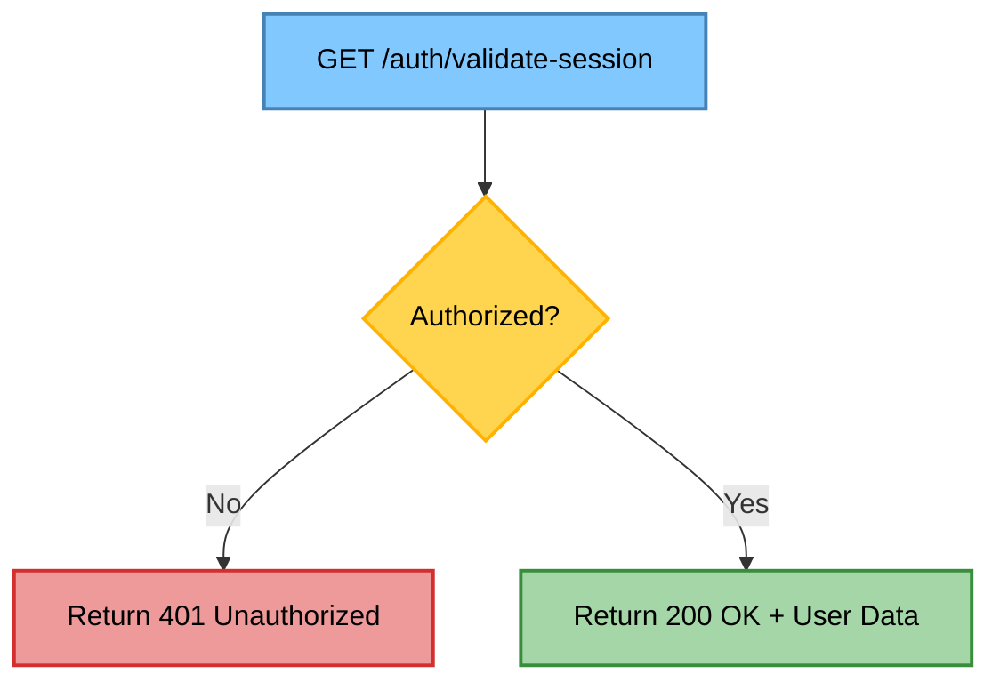
```mermaid

flowchart TD
%% API Flow: GET /auth/validate-session
Start[GET /auth/validate-session] --> Auth{Authorized?}

Auth -->|No| Auth401[Return 401 Unauthorized]
Auth -->|Yes| Success200[Return 200 OK + User Data]

classDef startEnd fill:#81C8FF,stroke:#4682B4,stroke-width:2px,color:#000;
classDef decision fill:#FFD54F,stroke:#FFB300,stroke-width:2px,color:#000;
classDef success fill:#A5D6A7,stroke:#388E3C,stroke-width:2px,color:#000;
classDef error fill:#EF9A9A,stroke:#D32F2F,stroke-width:2px,color:#000;
classDef warning fill:#FFCC80,stroke:#F57C00,stroke-width:2px,color:#000;

class Start,Success200 startEnd
class Auth decision
class Success200 success
class Auth401 error

```

</details>
</details>

<details>
<summary>USER</summary>

| URL        | Method | Auth Required | Description                         |
| ---------- | ------ | ------------- | ----------------------------------- |
| `/user/me` | GET    | True          | Retrieve authenticated user profile |

> <details>
> <summary>Response body</summary>
>
> ```json
> {
>   "statusCode": 200,
>   "data": {
>     "name": "ahrak nivah",
>     "email": "enyyvish@gmail.com",
>     "role": "CUSTOMER",
>     "is_verified": true,
>     "subscription_id": "6826d68a0fbea0d79998ef43",
>     "userId": "6826d68a0fbea0d79998ef45",
>     "created_at": "2025-05-16T06:09:14.000Z",
>     "is_deleted": false,
>     "updated_at": "2025-05-16T06:09:14.513Z",
>     "subscription": {
>       "_id": "6826d68a0fbea0d79998ef43",
>       "type": "HOBBY",
>       "key_limit": 2,
>       "usage_limit": 500,
>       "usage_count": 0,
>       "is_active": true,
>       "updated_at": "2025-05-16T06:09:14.288Z"
>     },
>     "keys": []
>   }
> }
> ```
>
> **Response:** `200 OK` - User profile retrieved successfully</br> > **Response:** `401 Unauthorized` - Not authenticated</br> > **Response:** `404 Not Found` - User not found
>
> </details>

<details>
<summary>Api Flow diagram</summary>

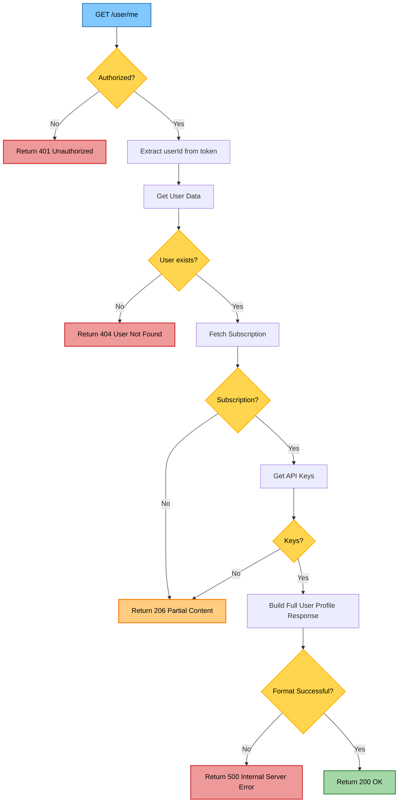
```mermaid
 flowchart TD
%% API Flow: GET /user/me
Start[GET /user/me] --> Auth{Authorized?}

Auth -->|No| Auth401[Return 401 Unauthorized]
Auth -->|Yes| ExtractUserId[Extract userId from token]

ExtractUserId --> GetUser[Get User Data]
GetUser --> UserExists{User exists?}

UserExists -->|No| User404[Return 404 User Not Found]
UserExists -->|Yes| GetSubscription[Fetch Subscription]

GetSubscription --> SubExists{Subscription?}
SubExists -->|No| Partial206[Return 206 Partial Content]
SubExists -->|Yes| GetKeys[Get API Keys]

GetKeys --> KeysFound{Keys?}
KeysFound -->|No| Partial206
KeysFound -->|Yes| FormatData[Build Full User Profile Response]

FormatData --> FormatSuccess{Format Successful?}
FormatSuccess -->|No| FormatError500[Return 500 Internal Server Error]
FormatSuccess -->|Yes| Success200[Return 200 OK]

classDef startEnd fill:#81C8FF,stroke:#4682B4,stroke-width:2px,color:#000;
classDef decision fill:#FFD54F,stroke:#FFB300,stroke-width:2px,color:#000;
classDef success fill:#A5D6A7,stroke:#388E3C,stroke-width:2px,color:#000;
classDef error fill:#EF9A9A,stroke:#D32F2F,stroke-width:2px,color:#000;
classDef warning fill:#FFCC80,stroke:#F57C00,stroke-width:2px,color:#000;

class Start,Success200 startEnd
class Auth,UserExists,SubExists,KeysFound,FormatSuccess decision
class Success200 success
class Auth401,User404,FormatError500 error
class Partial206 warning

```

</details>

---

| URL        | Method | Auth Required | Description                 |
| ---------- | ------ | ------------- | --------------------------- |
| `/user/me` | PATCH  | True          | Update user profile details |

> <details>
> <summary>Request body</summary>
>
> ```json
> {
>   "name": "local lamma"
> }
> ```
>
> </details>
>
> <details>
> <summary>Response body</summary>
>
> ```json
> {
>   "statusCode": 200
> }
> ```
>
> **Response:** `200 OK` - Profile updated successfully</br> > **Response:** `400 Bad Request` - Invalid input data</br> > **Response:** `401 Unauthorized` - Not authenticated
>
> </details>

<details>
<summary>Api Flow diagram</summary>

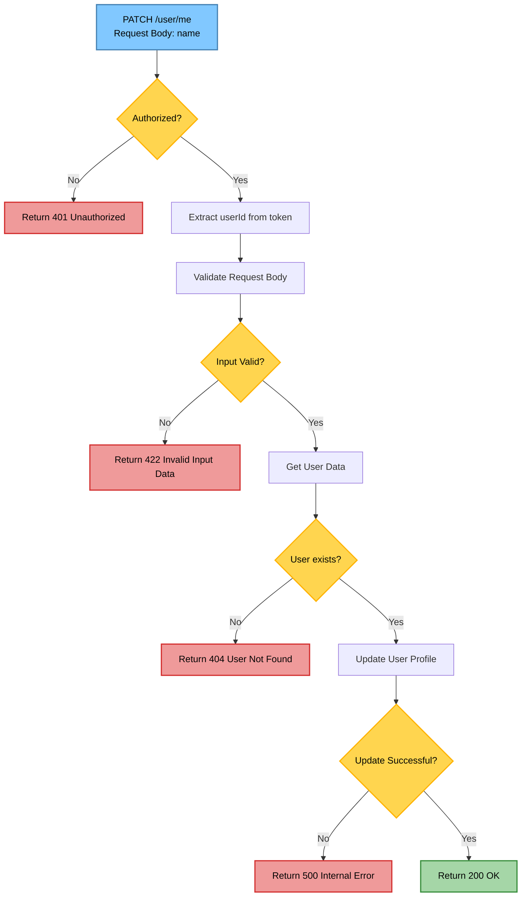
```mermaid
flowchart TD
%% API Flow: PATCH /user/me
Start[PATCH /user/me<br/>Request Body: name] --> Auth{Authorized?}

Auth -->|No| Auth401[Return 401 Unauthorized]
Auth -->|Yes| ExtractUserId[Extract userId from token]

ExtractUserId --> ValidateInput[Validate Request Body]
ValidateInput --> InputValid{Input Valid?}

InputValid -->|No| Input422[Return 422 Invalid Input Data]
InputValid -->|Yes| GetUser[Get User Data]

GetUser --> UserExists{User exists?}

UserExists -->|No| User404[Return 404 User Not Found]
UserExists -->|Yes| UpdateUser[Update User Profile]

UpdateUser --> UpdateSuccess{Update Successful?}
UpdateSuccess -->|No| Server500[Return 500 Internal Error]
UpdateSuccess -->|Yes| Success200[Return 200 OK]

classDef startEnd fill:#81C8FF,stroke:#4682B4,stroke-width:2px,color:#000;
classDef decision fill:#FFD54F,stroke:#FFB300,stroke-width:2px,color:#000;
classDef success fill:#A5D6A7,stroke:#388E3C,stroke-width:2px,color:#000;
classDef error fill:#EF9A9A,stroke:#D32F2F,stroke-width:2px,color:#000;
classDef warning fill:#FFCC80,stroke:#F57C00,stroke-width:2px,color:#000;

class Start,Success200 startEnd
class Auth,InputValid,UserExists,UpdateSuccess decision
class Success200 success
class Auth401,Input422,User404,Server500 error

```

</details>

---

| URL        | Method | Auth Required | Description                         |
| ---------- | ------ | ------------- | ----------------------------------- |
| `/user/me` | DELETE | True          | Permanently delete the user account |

> <details>
> <summary>Response body</summary>
>
> ```json
> {
>   "statusCode": 200
> }
> ```
>
> **Response:** `200 OK` - Account deleted successfully</br> > **Response:** `401 Unauthorized` - Not authenticated</br> > **Response:** `404 Not Found` - User not found
>
> </details>

<details>
<summary>Api Flow diagram</summary>

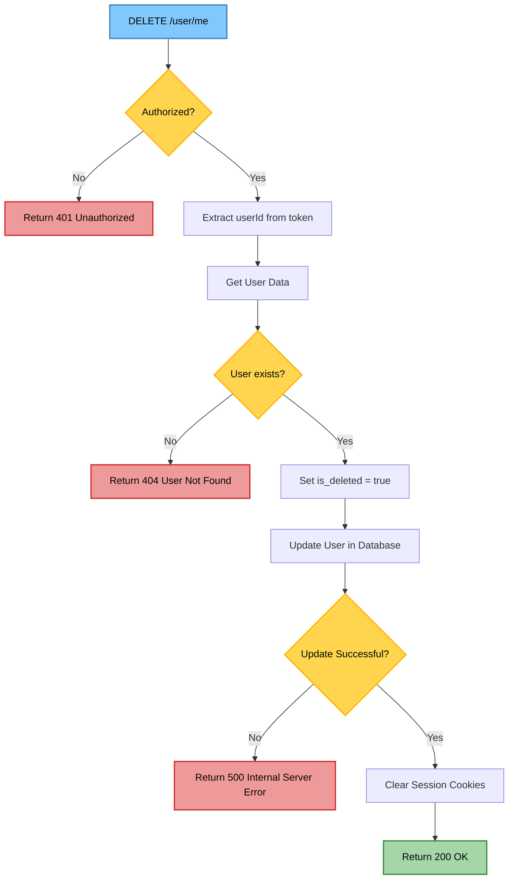
```mermaid
flowchart TD
%% API Flow: DELETE /user/me
Start[DELETE /user/me] --> Auth{Authorized?}

Auth -->|No| Auth401[Return 401 Unauthorized]
Auth -->|Yes| ExtractUserId[Extract userId from token]

ExtractUserId --> GetUser[Get User Data]
GetUser --> UserExists{User exists?}

UserExists -->|No| User404[Return 404 User Not Found]
UserExists -->|Yes| SoftDelete[Set is_deleted = true]

SoftDelete --> UpdateUser[Update User in Database]
UpdateUser --> UpdateSuccess{Update Successful?}

UpdateSuccess -->|No| Server500[Return 500 Internal Server Error]
UpdateSuccess -->|Yes| ClearCookies[Clear Session Cookies]

ClearCookies --> Success200[Return 200 OK]

classDef startEnd fill:#81C8FF,stroke:#4682B4,stroke-width:2px,color:#000;
classDef decision fill:#FFD54F,stroke:#FFB300,stroke-width:2px,color:#000;
classDef success fill:#A5D6A7,stroke:#388E3C,stroke-width:2px,color:#000;
classDef error fill:#EF9A9A,stroke:#D32F2F,stroke-width:2px,color:#000;
classDef warning fill:#FFCC80,stroke:#F57C00,stroke-width:2px,color:#000;

class Start,Success200 startEnd
class Auth,UserExists,UpdateSuccess decision
class Success200 success
class Auth401,User404,Server500 error
class SoftDelete,UpdateUser,ClearCookies process

```

</details>

---

| URL             | Method | Auth Required | Description            |
| --------------- | ------ | ------------- | ---------------------- |
| `/user/api-key` | POST   | True          | Generate a new API key |

> <details>
> <summary>Request body</summary>
>
> ```json
> { "expires_at": 30, "key_description": "sample key" }
> ```
>
> </details>
>
> <details>
> <summary>Response body</summary>
>
> ```json
> {
>   "statusCode": 200,
>   "data": {
>     "key_description": "sample key",
>     "subscription_id": "6826d68a0fbea0d79998ef43",
>     "_id": "684d52e03469f433197aa44a",
>     "api_key": "10E38C50555040A2A0220B6DB0AFDAE4",
>     "updated_at": "2025-06-14T10:45:52.395Z",
>     "__v": 0
>   }
> }
> ```
>
> **Response:** `200 OK` - API key generated successfully</br> > **Response:** `400 Bad Request` - Invalid input data</br> > **Response:** `401 Unauthorized` - Not authenticated</br> > **Response:** `403 Forbidden` - Key limit reached
>
> </details>

<details>
<summary>Api Flow diagram</summary>

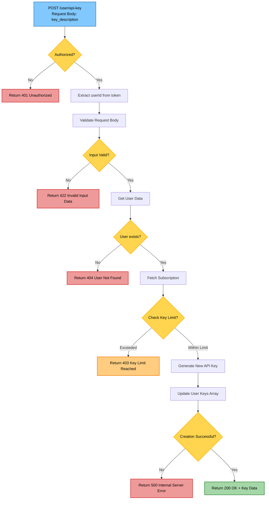
```mermaid
flowchart TD
%% API Flow: POST /user/api-key
Start[POST /user/api-key<br/>Request Body: key_description] --> Auth{Authorized?}

Auth -->|No| Auth401[Return 401 Unauthorized]
Auth -->|Yes| ExtractUserId[Extract userId from token]

ExtractUserId --> ValidateInput[Validate Request Body]
ValidateInput --> InputValid{Input Valid?}

InputValid -->|No| Input422[Return 422 Invalid Input Data]
InputValid -->|Yes| GetUser[Get User Data]

GetUser --> UserExists{User exists?}
UserExists -->|No| User404[Return 404 User Not Found]
UserExists -->|Yes| GetSubscription[Fetch Subscription]

GetSubscription --> CheckLimit{Check Key Limit?}
CheckLimit -->|Exceeded| Limit403[Return 403 Key Limit Reached]
CheckLimit -->|Within Limit| GenerateKey[Generate New API Key]

GenerateKey --> UpdateUser[Update User Keys Array]
UpdateUser --> CreateSuccess{Creation Successful?}

CreateSuccess -->|No| Server500[Return 500 Internal Server Error]
CreateSuccess -->|Yes| Success200[Return 200 OK + Key Data]

classDef startEnd fill:#81C8FF,stroke:#4682B4,stroke-width:2px,color:#000;
classDef decision fill:#FFD54F,stroke:#FFB300,stroke-width:2px,color:#000;
classDef success fill:#A5D6A7,stroke:#388E3C,stroke-width:2px,color:#000;
classDef error fill:#EF9A9A,stroke:#D32F2F,stroke-width:2px,color:#000;
classDef warning fill:#FFCC80,stroke:#F57C00,stroke-width:2px,color:#000;

class Start,Success200 startEnd
class Auth,InputValid,UserExists,CheckLimit,CreateSuccess decision
class Success200 success
class Auth401,Input422,User404,Server500 error
class Limit403 warning

```

</details>

---

| URL                       | Method | Auth Required | Description       |
| ------------------------- | ------ | ------------- | ----------------- |
| `/user/me/api-key/:keyId` | DELETE | True          | Revoke an API key |

> <details>
> <summary>Response body</summary>
>
> ```json
> {
>   "statusCode": 200
> }
> ```
>
> **Response:** `200 OK` - API key revoked successfully</br> > **Response:** `401 Unauthorized` - Not authenticated</br> > **Response:** `404 Not Found` - API key not found
>
> </details>

<details>
<summary>Api Flow diagram</summary>

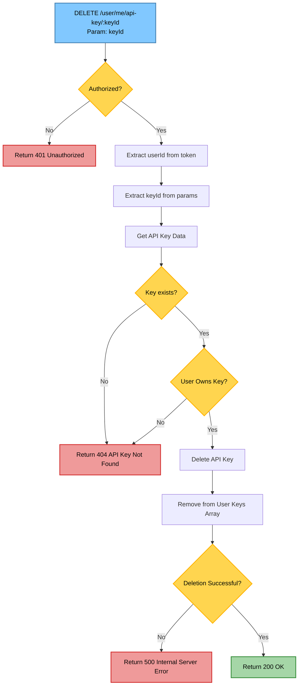
```mermaid
flowchart TD
%% API Flow: DELETE /user/me/api-key/:keyId
Start[DELETE /user/me/api-key/:keyId<br/>Param: keyId] --> Auth{Authorized?}

Auth -->|No| Auth401[Return 401 Unauthorized]
Auth -->|Yes| ExtractUserId[Extract userId from token]

ExtractUserId --> ExtractKeyId[Extract keyId from params]
ExtractKeyId --> GetKey[Get API Key Data]

GetKey --> KeyExists{Key exists?}
KeyExists -->|No| Key404[Return 404 API Key Not Found]
KeyExists -->|Yes| CheckOwnership{User Owns Key?}

CheckOwnership -->|No| Key404
CheckOwnership -->|Yes| DeleteKey[Delete API Key]

DeleteKey --> UpdateUser[Remove from User Keys Array]
UpdateUser --> DeleteSuccess{Deletion Successful?}

DeleteSuccess -->|No| Server500[Return 500 Internal Server Error]
DeleteSuccess -->|Yes| Success200[Return 200 OK]

classDef startEnd fill:#81C8FF,stroke:#4682B4,stroke-width:2px,color:#000;
classDef decision fill:#FFD54F,stroke:#FFB300,stroke-width:2px,color:#000;
classDef success fill:#A5D6A7,stroke:#388E3C,stroke-width:2px,color:#000;
classDef error fill:#EF9A9A,stroke:#D32F2F,stroke-width:2px,color:#000;
classDef warning fill:#FFCC80,stroke:#F57C00,stroke-width:2px,color:#000;

class Start,Success200 startEnd
class Auth,KeyExists,CheckOwnership,DeleteSuccess decision
class Success200 success
class Auth401,Key404,Server500 error

```

</details>

---

| URL                 | Method | Auth Required | Description          |
| ------------------- | ------ | ------------- | -------------------- |
| `/user/me/password` | PUT    | True          | Update user password |

> <details>
> <summary>Request body</summary>
>
> ```json
> {
>   "currPassword": "oldPassword123",
>   "newPassword": "newPassword123"
> }
> ```
>
> </details>
>
> <details>
> <summary>Response body</summary>
>
> ```json
> {
>   "statusCode": 200
> }
> ```
>
> **Response:** `200 OK` - Password updated successfully</br> > **Response:** `400 Bad Request` - Invalid input data</br> > **Response:** `401 Unauthorized` - Not authenticated or invalid current password
>
> </details>

 <details>
<summary>Api Flow diagram</summary>

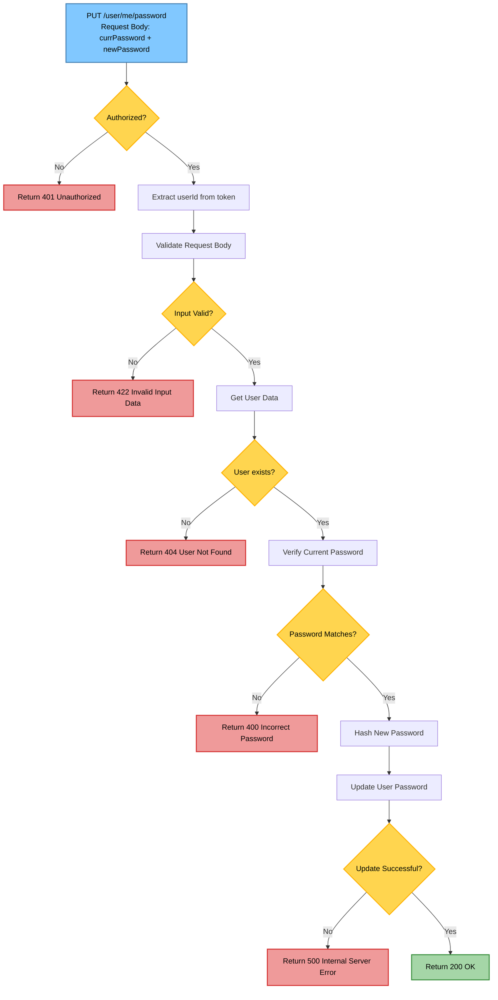
```mermaid
flowchart TD
%% API Flow: PUT /user/me/password
Start[PUT /user/me/password<br/>Request Body: currPassword + newPassword] --> Auth{Authorized?}

Auth -->|No| Auth401[Return 401 Unauthorized]
Auth -->|Yes| ExtractUserId[Extract userId from token]

ExtractUserId --> ValidateInput[Validate Request Body]
ValidateInput --> InputValid{Input Valid?}

InputValid -->|No| Input422[Return 422 Invalid Input Data]
InputValid -->|Yes| GetUser[Get User Data]

GetUser --> UserExists{User exists?}
UserExists -->|No| User404[Return 404 User Not Found]
UserExists -->|Yes| VerifyPassword[Verify Current Password]

VerifyPassword --> PasswordMatch{Password Matches?}
PasswordMatch -->|No| Password400[Return 400 Incorrect Password]
PasswordMatch -->|Yes| HashNewPassword[Hash New Password]

HashNewPassword --> UpdateUser[Update User Password]
UpdateUser --> UpdateSuccess{Update Successful?}

UpdateSuccess -->|No| Server500[Return 500 Internal Server Error]
UpdateSuccess -->|Yes| Success200[Return 200 OK]

classDef startEnd fill:#81C8FF,stroke:#4682B4,stroke-width:2px,color:#000;
classDef decision fill:#FFD54F,stroke:#FFB300,stroke-width:2px,color:#000;
classDef success fill:#A5D6A7,stroke:#388E3C,stroke-width:2px,color:#000;
classDef error fill:#EF9A9A,stroke:#D32F2F,stroke-width:2px,color:#000;
classDef warning fill:#FFCC80,stroke:#F57C00,stroke-width:2px,color:#000;

class Start,Success200 startEnd
class Auth,InputValid,UserExists,PasswordMatch,UpdateSuccess decision
class Success200 success
class Auth401,Input422,User404,Password400,Server500 error

```

</details>

---

| URL                | Method | Auth Required | Description        |
| ------------------ | ------ | ------------- | ------------------ |
| `/user/me/request` | POST   | True          | Raise logo Request |

> <details>
> <summary>Request body</summary>
>
> ```json
> {
>   "user_id": "6826d68a0fbea0d79998ef45",
>   "companyUrl": "https://company.com"
> }
> ```
>
> </details>
>
> <details>
> <summary>Response body</summary>
>
> ```json
> {
>   "statusCode": 200
> }
> ```
>
> **Response:** `200 OK` - Logo request submitted successfully</br> > **Response:** `400 Bad Request` - Invalid input data</br> > **Response:** `401 Unauthorized` - Not authenticated
>
> </details>

<details>
<summary>Api Flow diagram</summary>

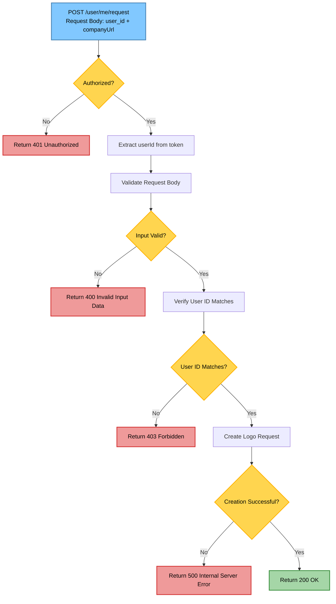
```mermaid
flowchart TD
%% API Flow: POST /user/me/request
Start[POST /user/me/request<br/>Request Body: user_id + companyUrl] --> Auth{Authorized?}

Auth -->|No| Auth401[Return 401 Unauthorized]
Auth -->|Yes| ExtractUserId[Extract userId from token]

ExtractUserId --> ValidateInput[Validate Request Body]
ValidateInput --> InputValid{Input Valid?}

InputValid -->|No| Input400[Return 400 Invalid Input Data]
InputValid -->|Yes| CheckUser[Verify User ID Matches]

CheckUser --> UserMatch{User ID Matches?}
UserMatch -->|No| User403[Return 403 Forbidden]
UserMatch -->|Yes| CreateRequest[Create Logo Request]

CreateRequest --> CreateSuccess{Creation Successful?}
CreateSuccess -->|No| Server500[Return 500 Internal Server Error]
CreateSuccess -->|Yes| Success200[Return 200 OK]

classDef startEnd fill:#81C8FF,stroke:#4682B4,stroke-width:2px,color:#000;
classDef decision fill:#FFD54F,stroke:#FFB300,stroke-width:2px,color:#000;
classDef success fill:#A5D6A7,stroke:#388E3C,stroke-width:2px,color:#000;
classDef error fill:#EF9A9A,stroke:#D32F2F,stroke-width:2px,color:#000;
classDef warning fill:#FFCC80,stroke:#F57C00,stroke-width:2px,color:#000;

class Start,Success200 startEnd
class Auth,InputValid,UserMatch,CreateSuccess decision
class Success200 success
class Auth401,Input400,User403,Server500 error

```

</details>

---

| URL              | Method | Auth Required | Description        |
| ---------------- | ------ | ------------- | ------------------ |
| `/user/download` | GET    | True          | Download User Data |

> <details>
> <summary>Response body</summary>
>
> ```json
> {
>   "profile": {
>     "userId": "69466f57a26c47c633efaa35",
>     "name": "John Doe I",
>     "email": "john.doe1@example.com",
>     "role": "CUSTOMER",
>     "accountCreatedAt": "2025-12-20T09:41:43.000Z"
>   },
>   "generationHistory": {
>     "totalGenerations": 0,
>     "generations": []
>   },
>   "usageStats": {
>     "apiCalls": 0,
>     "apiCallsLimit": 500
>   },
>   "security": {
>     "totalApiKeys": 2,
>     "apiKeys": [
>       {
>         "keyId": "6946731da26c47c633efaa6b",
>         "description": "hie",
>         "createdAt": "2025-12-20T09:57:49.000Z"
>       },
>       {
>         "keyId": "6946738da26c47c633efaa73",
>         "description": "sample description",
>         "createdAt": "2025-12-20T09:59:41.000Z"
>       }
>     ]
>   }
> }
> ```
>
> **Response:** `200 OK` - User data retrieved </br> > **Response:** `404 User not found` - User not found in database </br> > **Response:** `401 Unauthorized` - Not authenticated
>
> </details>

</details>

<details>
<summary>REWARDS</summary>

| URL                                              | Method | Auth Required | Description                                           |
| ------------------------------------------------ | ------ | ------------- | ----------------------------------------------------- |
| `/rewards/summary/user`                          | GET    | True          | Reward summary for the authenticated user             |
| `/rewards/summary/image/:imageId`                | GET    | False         | Reward summary for a specific image                   |
| `/rewards/leaderboard`                           | GET    | False         | Top creators leaderboard (query: <code>?limit=</code>)|
| `/rewards/leaderboard/rank`                      | GET    | True          | Authenticated user's rank in the leaderboard          |
| `/rewards/transactions/image/:imageId`           | GET    | False         | Paginated transaction history for an image            |
| `/rewards/transactions/user`                     | GET    | True          | Paginated transaction history for authenticated user  |
| `/rewards/transactions/stats/user`               | GET    | True          | Aggregated transaction statistics for authenticated user|
| `/rewards/transactions/:transactionId`           | GET    | False         | Get a specific transaction by ID                      |
| `/rewards/audit-trail/:imageId`                  | GET    | True          | Audit trail for an image (creator only)               |

> **Description**: The Rewards API allows creators to track reward points earned from their logos and view leaderboard rankings.

---

| URL                                              | `/rewards/summary/user` |
| ------------------------------------------------ | ----------------------- |
| Method                                           | GET                     |
| Auth Required                                    | Yes                     |
| Description                                      | Retrieves reward summary for the authenticated user, including total points, per-image breakdown, and reward statistics |

> <details>
> <summary>Response body</summary>
>
> ```json
> {
>   "statusCode": 200,
>   "data": {
>     "userId": "6826d68a0fbea0d79998ef45",
>     "userName": "John Doe",
>     "email": "john@example.com",
>     "currentPoints": 150,
>     "lifetimePoints": 500,
>     "totalImages": 3,
>     "totalPointsAwarded": 150,
>     "averagePointsPerImage": 50,
>     "rewards": [
>       {
>         "imageId": "6826d68a0fbea0d79998ef46",
>         "imageName": "Acme Corp",
>         "imageUrl": "https://...",
>         "uniqueProUsersCount": 25,
>         "totalPointsAwarded": 75,
>         "milestonesAchieved": 1
>       }
>     ]
>   }
> }
> ```
>
> **Response:** `200 OK` - Reward summary retrieved successfully</br>
> **Response:** `401 Unauthorized` - Not authenticated</br>
> **Response:** `404 Not Found` - User not found
> </details>
> <details>
> <summary>Api Flow diagram</summary>
>
> ```mermaid
> flowchart TD
> %% API Flow: GET /rewards/summary/user
> Start[GET /rewards/summary/user] --> Auth{Authorized?}
> Auth -->|No| Auth401[Return 401 Unauthorized]
> Auth -->|Yes| ExtractUserId[Extract userId from token]
> ExtractUserId --> GetUser[Fetch User Data]
> GetUser --> UserExists{User exists?}
> UserExists -->|No| User404[Return 404 Not Found]
> UserExists -->|Yes| FetchRewards[Fetch Reward Records]
> FetchRewards --> ComputeSummary[Compute Total Points & Per-Image Summary]
> ComputeSummary --> BuildResponse[Build Reward Summary Response]
> BuildResponse --> Success200[Return 200 OK with Summary]
>
> classDef startEnd fill:#81C8FF,stroke:#4682B4,stroke-width:2px,color:#000;
> classDef decision fill:#FFD54F,stroke:#FFB300,stroke-width:2px,color:#000;
> classDef success fill:#A5D6A7,stroke:#388E3C,stroke-width:2px,color:#000;
> classDef error fill:#EF9A9A,stroke:#D32F2F,stroke-width:2px,color:#000;
> classDef process fill:#B3E5FC,stroke:#0288D1,stroke-width:2px,color:#000;
> class Start,Success200 startEnd
> class Auth,UserExists decision
> class Success200 success
> class Auth401,User404 error
> class ExtractUserId,GetUser,FetchRewards,ComputeSummary,BuildResponse process
> ```
> </details>

---

| URL                                              | `/rewards/summary/image/:imageId` |
| ------------------------------------------------ | --------------------------------- |
| Method                                           | GET                               |
| Auth Required                                    | No                                |
| Description                                      | Retrieves reward summary for a specific image, including unique Pro user count, milestones achieved, and total points awarded |

> <details>
> <summary>Response body</summary>
>
> ```json
> {
>   "statusCode": 200,
>   "data": {
>     "imageId": "6826d68a0fbea0d79998ef46",
>     "imageName": "Acme Corp",
>     "creator": {
>       "id": "6826d68a0fbea0d79998ef45",
>       "name": "John Doe",
>       "email": "john@example.com"
>     },
>     "uniqueProUsersCount": 25,
>     "uniqueProUsers": ["..."],
>     "totalPointsAwarded": 75,
>     "milestonesAchieved": [
>       { "milestone": 10, "achieved_at": "2025-06-01T00:00:00.000Z", "points_awarded": 25 },
>       { "milestone": 25, "achieved_at": "2025-07-15T00:00:00.000Z", "points_awarded": 50 }
>     ],
>     "nextMilestone": 50
>   }
> }
> ```
>
> **Response:** `200 OK` - Reward summary retrieved successfully</br>
> **Response:** `404 Not Found` - No reward data found for this image
> </details>
> <details>
> <summary>Api Flow diagram</summary>
>
> ```mermaid
> flowchart TD
> %% API Flow: GET /rewards/summary/image/:imageId
> Start[GET /rewards/summary/image/:imageId] --> ValidateId{Valid imageId?}
> ValidateId -->|No| BadRequest400[Return 400 Bad Request]
> ValidateId -->|Yes| FindReward[Find Reward Record by imageId]
> FindReward --> RewardExists{Reward exists?}
> RewardExists -->|No| Image404[Return 404 Not Found]
> RewardExists -->|Yes| FetchImage[Fetch Image Details]
> FetchImage --> FetchCreator[Fetch Creator Info]
> FetchCreator --> FetchConfig[Fetch Active Milestone Config]
> FetchConfig --> ComputeNext[Determine Next Milestone]
> ComputeNext --> BuildResponse[Build Summary Response]
> BuildResponse --> Success200[Return 200 OK]
>
> classDef startEnd fill:#81C8FF,stroke:#4682B4,stroke-width:2px,color:#000;
> classDef decision fill:#FFD54F,stroke:#FFB300,stroke-width:2px,color:#000;
> classDef success fill:#A5D6A7,stroke:#388E3C,stroke-width:2px,color:#000;
> classDef error fill:#EF9A9A,stroke:#D32F2F,stroke-width:2px,color:#000;
> classDef process fill:#B3E5FC,stroke:#0288D1,stroke-width:2px,color:#000;
> class Start,Success200 startEnd
> class ValidateId,RewardExists decision
> class Success200 success
> class BadRequest400,Image404 error
> class FindReward,FetchImage,FetchCreator,FetchConfig,ComputeNext,BuildResponse process
> ```
> </details>

---

| URL                                              | `/rewards/leaderboard` |
| ------------------------------------------------ | ---------------------- |
| Method                                           | GET                    |
| Auth Required                                    | No                     |
| Description                                      | Retrieves the top creators ranked by total reward points. Supports an optional <code>?limit=</code> query parameter (default: 10) |

> <details>
> <summary>Query parameters</summary>
>
> - `limit`: Number of top creators to return (default: 10)
> </details>
> <details>
> <summary>Response body</summary>
>
> ```json
> {
>   "statusCode": 200,
>   "data": [
>     {
>       "rank": 1,
>       "userId": "6826d68a0fbea0d79998ef45",
>       "name": "John Doe",
>       "email": "john@example.com",
>       "totalPointsAwarded": 500,
>       "milestonesAchieved": 5
>     }
>   ]
> }
> ```
>
> **Response:** `200 OK` - Leaderboard retrieved successfully
> </details>
> <details>
> <summary>Api Flow diagram</summary>
>
> ```mermaid
> flowchart TD
> %% API Flow: GET /rewards/leaderboard
> Start[GET /rewards/leaderboard<br/>Query: ?limit=] --> ParseLimit[Parse limit parameter]
> ParseLimit --> ValidateLimit{Valid limit?}
> ValidateLimit -->|No| UseDefault[Use default limit: 10]
> ValidateLimit -->|Yes| CapLimit[Cap limit to max]
> UseDefault --> AggregateTop[Aggregate Top Creators]
> CapLimit --> AggregateTop
> AggregateTop --> FormatRanked[Format Ranked Results]
> FormatRanked --> Success200[Return 200 OK]
>
> classDef startEnd fill:#81C8FF,stroke:#4682B4,stroke-width:2px,color:#000;
> classDef decision fill:#FFD54F,stroke:#FFB300,stroke-width:2px,color:#000;
> classDef success fill:#A5D6A7,stroke:#388E3C,stroke-width:2px,color:#000;
> classDef process fill:#B3E5FC,stroke:#0288D1,stroke-width:2px,color:#000;
> class Start,Success200 startEnd
> class ValidateLimit decision
> class Success200 success
> class UseDefault process
> class ParseLimit,AggregateTop,FormatRanked,CapLimit process
> ```
> </details>

---

| URL                                              | `/rewards/leaderboard/rank` |
| ------------------------------------------------ | --------------------------- |
| Method                                           | GET                         |
| Auth Required                                    | Yes                         |
| Description                                      | Retrieves the authenticated user's rank in the leaderboard, including total points and total number of users |

> <details>
> <summary>Response body</summary>
>
> ```json
> {
>   "statusCode": 200,
>   "data": {
>     "rank": 5,
>     "totalPoints": 150,
>     "totalUsers": 120
>   }
> }
> ```
>
> **Response:** `200 OK` - User rank retrieved successfully</br>
> **Response:** `401 Unauthorized` - Not authenticated
> </details>
> <details>
> <summary>Api Flow diagram</summary>
>
> ```mermaid
> flowchart TD
> %% API Flow: GET /rewards/leaderboard/rank
> Start[GET /rewards/leaderboard/rank] --> Auth{Authorized?}
> Auth -->|No| Auth401[Return 401 Unauthorized]
> Auth -->|Yes| ExtractUserId[Extract userId from token]
> ExtractUserId --> AggregateRank[Aggregate User Rank]
> AggregateRank --> BuildResponse[Build Rank Response]
> BuildResponse --> Success200[Return 200 OK]
>
> classDef startEnd fill:#81C8FF,stroke:#4682B4,stroke-width:2px,color:#000;
> classDef decision fill:#FFD54F,stroke:#FFB300,stroke-width:2px,color:#000;
> classDef success fill:#A5D6A7,stroke:#388E3C,stroke-width:2px,color:#000;
> classDef error fill:#EF9A9A,stroke:#D32F2F,stroke-width:2px,color:#000;
> classDef process fill:#B3E5FC,stroke:#0288D1,stroke-width:2px,color:#000;
> class Start,Success200 startEnd
> class Auth decision
> class Success200 success
> class Auth401 error
> class ExtractUserId,AggregateRank,BuildResponse process
> ```
> </details>

---

| URL                                              | `/rewards/transactions/image/:imageId` |
| ------------------------------------------------ | -------------------------------------- |
| Method                                           | GET                                    |
| Auth Required                                    | No                                     |
| Description                                      | Retrieves paginated transaction history for a specific image |

> <details>
> <summary>Query parameters</summary>
>
> - `page`: Page number (default: 1)
> - `limit`: Results per page (default: 20)
> </details>
> <details>
> <summary>Response body</summary>
>
> ```json
> {
>   "statusCode": 200,
>   "data": {
>     "transactions": [...],
>     "total": 10,
>     "page": 1,
>     "totalPages": 1
>   }
> }
> ```
>
> **Response:** `200 OK` - Transactions retrieved successfully
> </details>

---

| URL                                              | `/rewards/transactions/user` |
| ------------------------------------------------ | ---------------------------- |
| Method                                           | GET                          |
| Auth Required                                    | Yes                          |
| Description                                      | Retrieves paginated transaction history for the authenticated user |

> <details>
> <summary>Query parameters</summary>
>
> - `page`: Page number (default: 1)
> - `limit`: Results per page (default: 20)
> </details>
> <details>
> <summary>Response body</summary>
>
> ```json
> {
>   "statusCode": 200,
>   "data": {
>     "transactions": [...],
>     "total": 10,
>     "page": 1,
>     "totalPages": 1
>   }
> }
> ```
>
> **Response:** `200 OK` - Transactions retrieved successfully</br>
> **Response:** `401 Unauthorized` - Not authenticated
> </details>
> <details>
> <summary>Api Flow diagram</summary>
>
> ```mermaid
> flowchart TD
> %% API Flow: GET /rewards/transactions/user
> Start[GET /rewards/transactions/user<br/>Query: ?page=&limit=] --> Auth{Authorized?}
> Auth -->|No| Auth401[Return 401 Unauthorized]
> Auth -->|Yes| ExtractUserId[Extract userId from token]
> ExtractUserId --> ParsePagination[Parse page & limit]
> ParsePagination --> FetchTransactions[Fetch Paginated Transactions]
> FetchTransactions --> BuildResponse[Build Response]
> BuildResponse --> Success200[Return 200 OK]
>
> classDef startEnd fill:#81C8FF,stroke:#4682B4,stroke-width:2px,color:#000;
> classDef decision fill:#FFD54F,stroke:#FFB300,stroke-width:2px,color:#000;
> classDef success fill:#A5D6A7,stroke:#388E3C,stroke-width:2px,color:#000;
> classDef error fill:#EF9A9A,stroke:#D32F2F,stroke-width:2px,color:#000;
> classDef process fill:#B3E5FC,stroke:#0288D1,stroke-width:2px,color:#000;
> class Start,Success200 startEnd
> class Auth decision
> class Success200 success
> class Auth401 error
> class ExtractUserId,PaginateTransactions,BuildResponse,FetchTransactions,PaginateTransaction process
> ```
> </details>

---

| URL                                              | `/rewards/transactions/stats/user` |
| ------------------------------------------------ | ---------------------------------- |
| Method                                           | GET                                |
| Auth Required                                    | Yes                                |
| Description                                      | Retrieves aggregated transaction statistics for the authenticated user, such as total points, transaction counts, etc. |

> <details>
> <summary>Response body</summary>
>
> ```json
> {
>   "statusCode": 200,
>   "data": {
>     "totalTransactions": 8,
>     "totalPointsAwarded": 150,
>     "totalPointsReversed": 0,
>     "bonusCount": 2,
>     "milestoneCount": 6
>   }
> }
> ```
>
> **Response:** `200 OK` - Stats retrieved successfully</br>
> **Response:** `401 Unauthorized` - Not authenticated
> </details>

---

| URL                                              | `/rewards/transactions/:transactionId` |
| ------------------------------------------------ | -------------------------------------- |
| Method                                           | GET                                    |
| Auth Required                                    | No                                     |
| Description                                      | Retrieves details of a specific reward transaction by ID |

> <details>
> <summary>Response body</summary>
>
> ```json
> {
>   "statusCode": 200,
>   "data": {
>     "_id": "6826d68a0fbea0d79998ef50",
>     "image_id": "6826d68a0fbea0d79998ef46",
>     "user_id": "6826d68a0fbea0d79998ef45",
>     "transaction_type": "MILESTONE_REWARD",
>     "milestone": 25,
>     "points_awarded": 50,
>     "description": "Milestone 25 reached - 25 unique Pro users",
>     "reason": "NORMAL_MILESTONE",
>     "previous_total": 25,
>     "new_total": 75,
>     "is_reversed": false,
>     "metadata": {
>       "unique_pro_users_count": 25,
>       "processed_at": "2025-07-15T00:00:00.000Z"
>     }
>   }
> }
> ```
>
> **Response:** `200 OK` - Transaction retrieved successfully</br>
> **Response:** `404 Not Found` - Transaction not found
> </details>

---

| URL                                              | `/rewards/audit-trail/:imageId` |
| ------------------------------------------------ | ------------------------------- |
| Method                                           | GET                             |
| Auth Required                                    | Yes (creator only)              |
| Description                                      | Retrieves the reward audit trail for a specific image, showing all reward-related changes and history |

> <details>
> <summary>Response body</summary>
>
> ```json
> {
>   "statusCode": 200,
>   "data": [...]
> }
> ```
>
> **Response:** `200 OK` - Audit trail retrieved successfully</br>
> **Response:** `401 Unauthorized` - Not authenticated</br>
> **Response:** `403 Forbidden` - Not the creator of this image
> </details>
> <details>
> <summary>Api Flow diagram</summary>
>
> ```mermaid
> flowchart TD
> %% API Flow: GET /rewards/audit-trail/:imageId
> Start[GET /rewards/audit-trail/:imageId] --> Auth{Authorized?}
> Auth -->|No| Auth401[Return 401 Unauthorized]
> Auth -->|Yes| ExtractUserId[Extract userId from token]
> ExtractUserId --> ValidateImage{Valid imageId?}
> ValidateImage -->|No| BadRequest400[Return 400 Bad Request]
> ValidateImage -->|Yes| VerifyOwnership{User is creator<br/>of this image?}
> VerifyOwnership -->|No| Forbidden403[Return 403 Forbidden]
> VerifyOwnership -->|Yes| FetchAuditTrail[Fetch Audit Trail]
> FetchAuditTrail --> BuildResponse[Build Response]
> BuildResponse --> Success200[Return 200 OK]
>
> classDef startEnd fill:#81C8FF,stroke:#4682B4,stroke-width:2px,color:#000;
> classDef decision fill:#FFD54F,stroke:#FFB300,stroke-width:2px,color:#000;
> classDef success fill:#A5D6A7,stroke:#388E3C,stroke-width:2px,color:#000;
> classDef error fill:#EF9A9A,stroke:#D32F2F,stroke-width:2px,color:#000;
> classDef process fill:#B3E5FC,stroke:#0288D1,stroke-width:2px,color:#000;
> class Start,Success200 startEnd
> class Auth,ValidateImage,VerifyOwnership decision
> class Success200 success
> class Auth401,BadRequest400,Forbidden403 error
> class ExtractUserId,FetchAuditTrail,BuildResponse process
> ```
> </details>

</details>

<details>
<summary>ADMIN</summary>

| URL              | Method | Auth Required | Description             |
| ---------------- | ------ | ------------- | ----------------------- |
| `/catalog/stats` | GET    | True          | Get the user statistics |

> <details>
> <summary>Response body</summary>
>
> ```json
> {
>   "statusCode": 200,
>   "data": {
>     "Users": 10,
>     "Keys": 2,
>     "Requests": 0,
>     "Hits": 0
>   }
> }
> ```
>
> **Response:** `200 OK` - Statistics retrieved successfully</br> > **Response:** `401 Unauthorized` - Not authenticated</br> > **Response:** `403 Forbidden` - Not authorized
>
> </details>

<details>
<summary>Api flow diagram</summary>

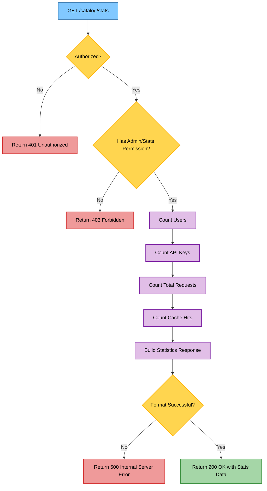
```mermaid
flowchart TD
%% API Flow: GET /catalog/stats
Start[GET /catalog/stats] --> Auth{Authorized?}
Auth -->|No| Auth401[Return 401 Unauthorized]
Auth -->|Yes| CheckPerms{Has Admin/Stats Permission?}
CheckPerms -->|No| Forbidden403[Return 403 Forbidden]
CheckPerms -->|Yes| GetUsers[Count Users]
GetUsers --> GetKeys[Count API Keys]
GetKeys --> GetRequests[Count Total Requests]
GetRequests --> GetHits[Count Cache Hits]
GetHits --> BuildStats[Build Statistics Response]
BuildStats --> FormatSuccess{Format Successful?}
FormatSuccess -->|No| FormatError500[Return 500 Internal Server Error]
FormatSuccess -->|Yes| Success200[Return 200 OK with Stats Data]

classDef startEnd fill:#81C8FF,stroke:#4682B4,stroke-width:2px,color:#000;
classDef decision fill:#FFD54F,stroke:#FFB300,stroke-width:2px,color:#000;
classDef success fill:#A5D6A7,stroke:#388E3C,stroke-width:2px,color:#000;
classDef error fill:#EF9A9A,stroke:#D32F2F,stroke-width:2px,color:#000;
classDef process fill:#E1BEE7,stroke:#7B1FA2,stroke-width:2px,color:#000;

class Start,Success200 startEnd
class Auth,CheckPerms,FormatSuccess decision
class Success200 success
class Auth401,Forbidden403,FormatError500 error
class GetUsers,GetKeys,GetRequests,GetHits,BuildStats process

```

</details>

---

| URL                                       | Method | Auth Required | Description                 |
| ----------------------------------------- | ------ | ------------- | --------------------------- |
| `/catalog/permission/:userId/roles/:role` | PUT    | True          | Assign or modify user roles |

 <details>
 <summary>Request body</summary>

```json
{
  "email": "email@user.com"
}
```

 </details>
 <details>
 <summary>Response body</summary>

```json
{
  "statusCode": 200
}
```

**Response:** `200 OK` - Role updated successfully</br>
**Response:** `400 Bad Request` - Invalid role</br>
**Response:** `401 Unauthorized` - Not authenticated</br>
**Response:** `403 Forbidden` - Not authorized</br>
**Response:** `404 Not Found` - User not found

 </details>
<details>
<summary>Api flow diagram </summary>

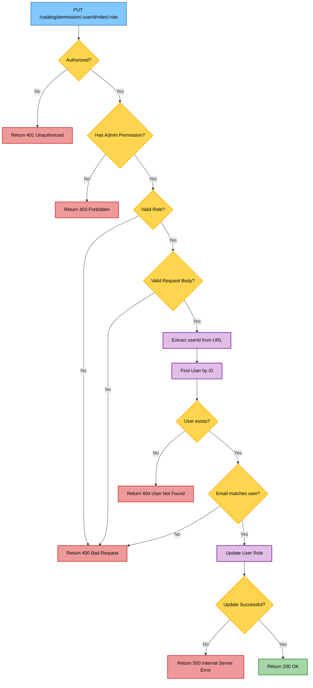
```mermaid
flowchart TD
%% API Flow: PUT /catalog/permission/:userId/roles/:role
Start[PUT /catalog/permission/:userId/roles/:role] --> Auth{Authorized?}
Auth -->|No| Auth401[Return 401 Unauthorized]
Auth -->|Yes| CheckPerms{Has Admin Permission?}
CheckPerms -->|No| Forbidden403[Return 403 Forbidden]
CheckPerms -->|Yes| ValidateRole{Valid Role?}
ValidateRole -->|No| BadRequest400[Return 400 Bad Request]
ValidateRole -->|Yes| ValidateBody{Valid Request Body?}
ValidateBody -->|No| BadRequest400
ValidateBody -->|Yes| ExtractUserId[Extract userId from URL]
ExtractUserId --> FindUser[Find User by ID]
FindUser --> UserExists{User exists?}
UserExists -->|No| NotFound404[Return 404 User Not Found]
UserExists -->|Yes| ValidateEmail{Email matches user?}
ValidateEmail -->|No| BadRequest400
ValidateEmail -->|Yes| UpdateRole[Update User Role]
UpdateRole --> UpdateSuccess{Update Successful?}
UpdateSuccess -->|No| UpdateError500[Return 500 Internal Server Error]
UpdateSuccess -->|Yes| Success200[Return 200 OK]

classDef startEnd fill:#81C8FF,stroke:#4682B4,stroke-width:2px,color:#000;
classDef decision fill:#FFD54F,stroke:#FFB300,stroke-width:2px,color:#000;
classDef success fill:#A5D6A7,stroke:#388E3C,stroke-width:2px,color:#000;
classDef error fill:#EF9A9A,stroke:#D32F2F,stroke-width:2px,color:#000;
classDef process fill:#E1BEE7,stroke:#7B1FA2,stroke-width:2px,color:#000;

class Start,Success200 startEnd
class Auth,CheckPerms,ValidateRole,ValidateBody,UserExists,ValidateEmail,UpdateSuccess decision
class Success200 success
class Auth401,Forbidden403,BadRequest400,NotFound404,UpdateError500 error
class ExtractUserId,FindUser,UpdateRole process
```

</details>

---

| URL             | Method | Auth Required | Description               |
| --------------- | ------ | ------------- | ------------------------- |
| `/catalog/logo` | POST   | True          | Upload a new company logo |

> <details>
> <summary>Request body</summary>
>
> ```
> Form Data:
>   logo: File - The logo file to upload
>   companyUri: string - The company URL
> ```
>
> </details>
>
> <details>
> <summary>Response body</summary>
>
> ```json
> {
>   "statusCode": 200,
>   "message": "Image updated successfully.",
>   "data": {
>     "_id": "image_id",
>     "updatedAt": "timestamp"
>   }
> }
> ```
>
> **Response:** `200 OK` - Logo uploaded successfully </br> > **Response:** `400 Bad Request` - Invalid input data</br> > **Response:** `401 Unauthorized` - Not authenticated</br> > **Response:** `403 Forbidden` - Not authorized
>
> </details>

<details>
<summary>Api flow diagram </summary>

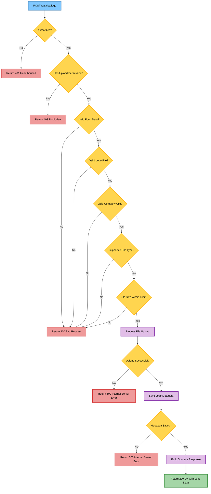
```mermaid
flowchart TD
%% API Flow: POST /catalog/logo
Start[POST /catalog/logo] --> Auth{Authorized?}
Auth -->|No| Auth401[Return 401 Unauthorized]
Auth -->|Yes| CheckPerms{Has Upload Permission?}
CheckPerms -->|No| Forbidden403[Return 403 Forbidden]
CheckPerms -->|Yes| ValidateFormData{Valid Form Data?}
ValidateFormData -->|No| BadRequest400[Return 400 Bad Request]
ValidateFormData -->|Yes| ValidateFile{Valid Logo File?}
ValidateFile -->|No| BadRequest400
ValidateFile -->|Yes| ValidateUri{Valid Company URI?}
ValidateUri -->|No| BadRequest400
ValidateUri -->|Yes| CheckFileType{Supported File Type?}
CheckFileType -->|No| BadRequest400
CheckFileType -->|Yes| CheckFileSize{File Size Within Limit?}
CheckFileSize -->|No| BadRequest400
CheckFileSize -->|Yes| ProcessUpload[Process File Upload]
ProcessUpload --> UploadSuccess{Upload Successful?}
UploadSuccess -->|No| UploadError500[Return 500 Internal Server Error]
UploadSuccess -->|Yes| SaveMetadata[Save Logo Metadata]
SaveMetadata --> MetadataSuccess{Metadata Saved?}
MetadataSuccess -->|No| MetadataError500[Return 500 Internal Server Error]
MetadataSuccess -->|Yes| BuildResponse[Build Success Response]
BuildResponse --> Success200[Return 200 OK with Logo Data]

classDef startEnd fill:#81C8FF,stroke:#4682B4,stroke-width:2px,color:#000;
classDef decision fill:#FFD54F,stroke:#FFB300,stroke-width:2px,color:#000;
classDef success fill:#A5D6A7,stroke:#388E3C,stroke-width:2px,color:#000;
classDef error fill:#EF9A9A,stroke:#D32F2F,stroke-width:2px,color:#000;
classDef process fill:#E1BEE7,stroke:#7B1FA2,stroke-width:2px,color:#000;

class Start,Success200 startEnd
class Auth,CheckPerms,ValidateFormData,ValidateFile,ValidateUri,CheckFileType,CheckFileSize,UploadSuccess,MetadataSuccess decision
class Success200 success
class Auth401,Forbidden403,BadRequest400,UploadError500,MetadataError500 error
class ProcessUpload,SaveMetadata,BuildResponse process
```

</details>

---

| URL             | Method | Auth Required | Description             |
| --------------- | ------ | ------------- | ----------------------- |
| `/catalog/logo` | PUT    | True          | Update an existing logo |

> <details>
> <summary>Request body</summary>
>
> ```
> Form Data:
>   logo: File  - The logo file to upload
>   id: string  - The ID of the logo to update
> ```
>
> </details>
>
> <details>
> <summary>Response body</summary>
>
> ```json
> {
>   "statusCode": 200,
>   "message": "Image updated successfully.",
>   "data": {
>     "_id": "image_id",
>     "updatedAt": "timestamp"
>   }
> }
> ```
>
> **Response:** `200 OK` - Logo updated successfully</br> > **Response:** `400 Bad Request` - Invalid input data</br> > **Response:** `401 Unauthorized` - Not authenticated</br> > **Response:** `403 Forbidden` - Not authorized</br> > **Response:** `404 Not Found` - Logo not found
>
> </details>

<details>
<summary>Api flow diagram </summary>

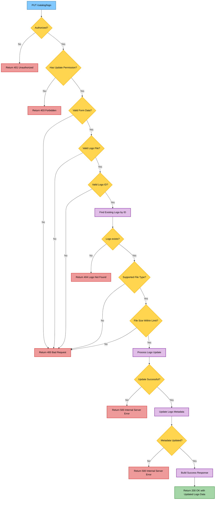
```mermaid
flowchart TD
%% API Flow: PUT /catalog/logo
Start[PUT /catalog/logo] --> Auth{Authorized?}
Auth -->|No| Auth401[Return 401 Unauthorized]
Auth -->|Yes| CheckPerms{Has Update Permission?}
CheckPerms -->|No| Forbidden403[Return 403 Forbidden]
CheckPerms -->|Yes| ValidateFormData{Valid Form Data?}
ValidateFormData -->|No| BadRequest400[Return 400 Bad Request]
ValidateFormData -->|Yes| ValidateFile{Valid Logo File?}
ValidateFile -->|No| BadRequest400
ValidateFile -->|Yes| ValidateId{Valid Logo ID?}
ValidateId -->|No| BadRequest400
ValidateId -->|Yes| FindLogo[Find Existing Logo by ID]
FindLogo --> LogoExists{Logo exists?}
LogoExists -->|No| NotFound404[Return 404 Logo Not Found]
LogoExists -->|Yes| CheckFileType{Supported File Type?}
CheckFileType -->|No| BadRequest400
CheckFileType -->|Yes| CheckFileSize{File Size Within Limit?}
CheckFileSize -->|No| BadRequest400
CheckFileSize -->|Yes| ProcessUpdate[Process Logo Update]
ProcessUpdate --> UpdateSuccess{Update Successful?}
UpdateSuccess -->|No| UpdateError500[Return 500 Internal Server Error]
UpdateSuccess -->|Yes| UpdateMetadata[Update Logo Metadata]
UpdateMetadata --> MetadataSuccess{Metadata Updated?}
MetadataSuccess -->|No| MetadataError500[Return 500 Internal Server Error]
MetadataSuccess -->|Yes| BuildResponse[Build Success Response]
BuildResponse --> Success200[Return 200 OK with Updated Logo Data]

classDef startEnd fill:#81C8FF,stroke:#4682B4,stroke-width:2px,color:#000;
classDef decision fill:#FFD54F,stroke:#FFB300,stroke-width:2px,color:#000;
classDef success fill:#A5D6A7,stroke:#388E3C,stroke-width:2px,color:#000;
classDef error fill:#EF9A9A,stroke:#D32F2F,stroke-width:2px,color:#000;
classDef process fill:#E1BEE7,stroke:#7B1FA2,stroke-width:2px,color:#000;

class Start,Success200 startEnd
class Auth,CheckPerms,ValidateFormData,ValidateFile,ValidateId,LogoExists,CheckFileType,CheckFileSize,UpdateSuccess,MetadataSuccess decision
class Success200 success
class Auth401,Forbidden403,BadRequest400,NotFound404,UpdateError500,MetadataError500 error
class FindLogo,ProcessUpdate,UpdateMetadata,BuildResponse process

```

</details>

---
| URL | Method | Auth Required | Description |
|-----|--------|---------------|-------------|
| `/catalog/logos` | GET | True | Retrieve company logos from the database or fetch from the web if not found |

#### Query Parameters

- `companyName` (string, **required**) — Name of the company whose logo is being requested

#### Request Example

```
GET /catalog/logos?companyName=company-name
```

#### Endpoint Behavior

- If the logo **exists in the database**, the API returns the stored catalog record
- If the logo **does not exist in the database**, the API performs a web search and returns logo results fetched from external sources

The response includes a `source` field to indicate where the data was retrieved from (`db` or `web`)

> <details>
> <summary>Response body — Logo found in database (`source: db`)</summary>
>
> ```json
> {
>   "statusCode": 200,
>   "source": "db",
>   "data": {
>     "_id": "694a4c763ce421392f7cf6fa",
>     "user_id": "690cf07126a7cd2c795f9fd4",
>     "company_name": "Company Name",
>     "company_uri": "https://company.com/",
>     "image_size": 1984,
>     "extension": "png",
>     "is_deleted": false,
>     "created_at": "2025-12-23T08:01:58.000Z",
>     "updated_at": "2025-12-23T08:01:58.931Z"
>   }
> }
> ```
>
> </details>

> <details>
> <summary>Response body — Logo not found, fetched from web (`source: web`)</summary>
>
> ```json
> {
>   "statusCode": 200,
>   "source": "web",
>   "data": [
>     {
>       "companyName": "Company Name",
>       "url": "https://example.com/assets/logo-horizontal.svg",
>       "companyUri": "https://company.com/",
>       "extension": "svg",
>       "size": 11428,
>       "bufferBase64": "PHN2ZyB4bWxucz0iaHR0cDovL3d3dy53My5vcmcvMjAwMC9zdmciIHdpZHRoPSIxMDAiIGhlaWdodD0iMTAwIj4uLi48L3N2Zz4=",
>       "mimeType": "image/svg+xml"
>     },
>     {
>       "companyName": "Company Name",
>       "url": "https://example.com/assets/logo-icon.svg",
>       "companyUri": "https://company.com/",
>       "extension": "svg",
>       "size": 711,
>       "bufferBase64": "PHN2ZyB4bWxucz0iaHR0cDovL3d3dy53My5vcmcvMjAwMC9zdmciIHdpZHRoPSI1MCIgaGVpZ2h0PSI1MCI+Li4uPC9zdmc+",
>       "mimeType": "image/svg+xml"
>     }
>   ]
> }
> ```
>
> </details>

> <details>
> <summary>Error Responses</summary>
>
> **Response:** `400 Bad Request` - Missing or invalid query parameters</br>
> **Response:** `401 Unauthorized` - Authentication required or invalid credentials</br>
> **Response:** `403 Forbidden` - Insufficient permissions
> </details>
<details>
<summary> Api flow diagram</summary>

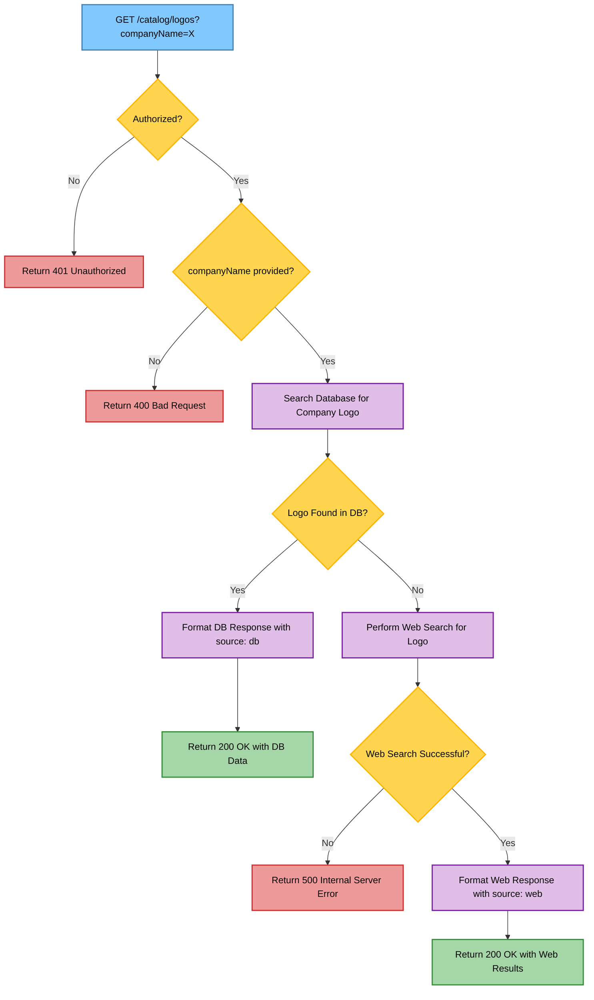
```mermaid
flowchart TD
%% API Flow: GET /catalog/logos
Start[GET /catalog/logos?companyName=X] --> Auth{Authorized?}
Auth -->|No| Auth401[Return 401 Unauthorized]
Auth -->|Yes| ValidateParams{companyName provided?}
ValidateParams -->|No| BadRequest400[Return 400 Bad Request]
ValidateParams -->|Yes| QueryDB[Search Database for Company Logo]
QueryDB --> DBFound{Logo Found in DB?}
DBFound -->|Yes| FormatDB[Format DB Response with source: db]
FormatDB --> Success200DB[Return 200 OK with DB Data]
DBFound -->|No| WebSearch[Perform Web Search for Logo]
WebSearch --> WebSuccess{Web Search Successful?}
WebSuccess -->|No| WebError500[Return 500 Internal Server Error]
WebSuccess -->|Yes| FormatWeb[Format Web Response with source: web]
FormatWeb --> Success200Web[Return 200 OK with Web Results]

classDef startEnd fill:#81C8FF,stroke:#4682B4,stroke-width:2px,color:#000;
classDef decision fill:#FFD54F,stroke:#FFB300,stroke-width:2px,color:#000;
classDef success fill:#A5D6A7,stroke:#388E3C,stroke-width:2px,color:#000;
classDef error fill:#EF9A9A,stroke:#D32F2F,stroke-width:2px,color:#000;
classDef process fill:#E1BEE7,stroke:#7B1FA2,stroke-width:2px,color:#000;

class Start,Success200DB,Success200Web startEnd
class Auth,ValidateParams,DBFound,WebSuccess decision
class Success200DB,Success200Web success
class Auth401,BadRequest400,WebError500 error
class QueryDB,FormatDB,WebSearch,FormatWeb process
```
</details>

---

| URL                                                      | Method | Auth Required | Description                                                       |
| -------------------------------------------------------- | ------ | ------------- | ----------------------------------------------------------------- |
| `/admin/users/:userId/subscription`                      | PATCH  | Admin         | Change a user's subscription plan                                 |
| `/admin/users/subscription/logs`                         | GET    | Admin         | Paginated list of subscription change audit logs                  |
| `/admin/rewards/transactions/search`                     | GET    | Admin         | Search transactions with multiple filter options                  |
| `/admin/rewards/bonus`                                   | POST   | Admin         | Award bonus reward points to a user                               |
| `/admin/rewards/transactions/:transactionId/reverse`     | POST   | Admin         | Reverse/undo a reward transaction                                 |
| `/admin/milestones`                                      | GET    | Admin         | List all non-deleted milestone configs (active first)             |
| `/admin/milestones/:id`                                  | GET    | Admin         | Get a single milestone config by ID                               |
| `/admin/milestones`                                      | POST   | Admin         | Create a new milestone config (inactive by default)               |
| `/admin/milestones/:id/activate`                         | PATCH  | Admin         | Activate a milestone config; deactivates all others               |
| `/admin/milestones/:id`                                  | PATCH  | Admin         | Update an inactive milestone config                               |
| `/admin/milestones/:id`                                  | DELETE | Admin         | Soft-delete an inactive milestone config                          |

---

| URL                                              | `/admin/users/:userId/subscription` |
| ------------------------------------------------ | ----------------------------------- |
| Method                                           | PATCH                               |
| Auth Required                                    | Admin                               |
| Description                                      | Upgrades or downgrades a user's subscription plan. Preserves the existing usage count |

> <details>
> <summary>Request body</summary>
>
> ```json
> {
>   "plan": "PRO",
>   "reason": "User requested upgrade"
> }
> ```
>
> | Field    | Type            | Description                                         |
> | -------- | --------------- | --------------------------------------------------- |
> | `plan`   | string (enum)   | Target plan: <code>HOBBY</code> or <code>PRO</code> (required) |
> | `reason` | string (optional)| Reason for the plan change (max 200 chars)         |
> </details>
> <details>
> <summary>Response body</summary>
>
> ```json
> {
>   "statusCode": 200,
>   "message": "Subscription plan updated successfully.",
>   "data": {
>     "_id": "6826d68a0fbea0d79998ef43",
>     "type": "PRO",
>     "key_limit": 5,
>     "usage_limit": 15000,
>     "usage_count": 42,
>     "is_active": true,
>     "updated_at": "2025-07-15T12:00:00.000Z"
>   }
> }
> ```
>
> **Response:** `200 OK` - Plan changed successfully</br>
> **Response:** `400 Bad Request` - Invalid userId or user already on this plan</br>
> **Response:** `401 Unauthorized` - Not authenticated</br>
> **Response:** `403 Forbidden` - Not authorized (non-admin)</br>
> **Response:** `404 Not Found` - User or subscription not found</br>
> **Response:** `422 Unprocessable Entity` - Invalid plan value
> </details>
> <details>
> <summary>Api Flow diagram</summary>
>
> ```mermaid
> flowchart TD
> %% API Flow: PATCH /admin/users/:userId/subscription
> Start[PATCH /admin/users/:userId/subscription] --> Auth{Authorized?}
> Auth -->|No| Auth401[Return 401 Unauthorized]
> Auth -->|Yes| CheckPerms{Is Admin?}
> CheckPerms -->|No| Forbidden403[Return 403 Forbidden]
> CheckPerms -->|Yes| ValidateBody[Validate Request Body]
> ValidateBody --> BodyValid{Valid plan?}
> BodyValid -->|No| Unprocessable422[Return 422 Unprocessable Entity]
> BodyValid -->|Yes| ValidateUserId{Valid userId?}
> ValidateUserId -->|No| BadRequest400[Return 400 Invalid userId]
> ValidateUserId -->|Yes| BeginTransaction[Start MongoDB Transaction]
> BeginTransaction --> FindUser[Find User]
> FindUser --> UserExists{User exists?}
> UserExists -->|No| NotFound404[Return 404 Not Found]
> UserExists -->|Yes| FindSubscription[Find Subscription]
> FindSubscription --> SubExists{Subscription exists?}
> SubExists -->|No| NotFound404Sub[Return 404 Not Found]
> SubExists -->|Yes| SamePlan{Already on<br/>this plan?}
> SamePlan -->|Yes| Conflict400[Return 400 Already Active]
> SamePlan -->|No| UpdatePlan[Update Subscription Plan]
> UpdatePlan --> CreateLog[Create Audit Log Entry]
> CreateLog --> CommitTransaction[Commit Transaction]
> CommitTransaction --> Success200[Return 200 OK]
>
> classDef startEnd fill:#81C8FF,stroke:#4682B4,stroke-width:2px,color:#000;
> classDef decision fill:#FFD54F,stroke:#FFB300,stroke-width:2px,color:#000;
> classDef success fill:#A5D6A7,stroke:#388E3C,stroke-width:2px,color:#000;
> classDef error fill:#EF9A9A,stroke:#D32F2F,stroke-width:2px,color:#000;
> classDef process fill:#E1BEE7,stroke:#7B1FA2,stroke-width:2px,color:#000;
>
> class Start,Success200 startEnd
> class Auth,CheckPerms,BodyValid,ValidateUserId,UserExists,SubExists,SamePlan decision
> class Success200 success
> class Auth401,Forbidden403,Unprocessable422,BadRequest400,NotFound404,NotFound404Sub,Conflict400 error
> class ValidateBody,FindUser,FindSubscription,UpdatePlan,CreateLog,BeginTransaction,CommitTransaction process
> ```
> </details>

---

| URL                                              | `/admin/users/subscription/logs` |
| ------------------------------------------------ | -------------------------------- |
| Method                                           | GET                              |
| Auth Required                                    | Admin                            |
| Description                                      | Returns a paginated list of all subscription plan-change audit logs |

> <details>
> <summary>Query parameters</summary>
>
> - `page`: Page number (default: 1)
> - `limit`: Results per page, max 100 (default: 10)
> </details>
> <details>
> <summary>Response body</summary>
>
> ```json
> {
>   "statusCode": 200,
>   "data": [
>     {
>       "_id": "6826d68a0fbea0d79998ef50",
>       "user_id": "6826d68a0fbea0d79998ef45",
>       "subscription_id": "6826d68a0fbea0d79998ef43",
>       "changed_by": "6826d68a0fbea0d79998ef99",
>       "from_plan": "HOBBY",
>       "to_plan": "PRO",
>       "reason": "User requested upgrade",
>       "createdAt": "2025-07-15T12:00:00.000Z"
>     }
>   ],
>   "total": 1,
>   "currentPage": 1,
>   "totalPages": 1
> }
> ```
>
> **Response:** `200 OK` - Logs retrieved successfully</br>
> **Response:** `401 Unauthorized` - Not authenticated</br>
> **Response:** `403 Forbidden` - Not authorized (non-admin)
> </details>
> <details>
> <summary>Api Flow diagram</summary>
>
> ```mermaid
> flowchart TD
> %% API Flow: GET /admin/users/subscription/logs
> Start[GET /admin/users/subscription/logs<br/>Query: ?page=&limit=] --> Auth{Authorized?}
> Auth -->|No| Auth401[Return 401 Unauthorized]
> Auth -->|Yes| CheckPerms{Is Admin?}
> CheckPerms -->|No| Forbidden403[Return 403 Forbidden]
> CheckPerms -->|Yes| ValidateQuery[Validate Query Params]
> ValidateQuery --> ParsePagination[Parse page & limit]
> ParsePagination --> FetchLogs[Fetch Paginated Subscription Logs]
> FetchLogs --> BuildResponse[Build Response]
> BuildResponse --> Success200[Return 200 OK]
>
> classDef startEnd fill:#81C8FF,stroke:#4682B4,stroke-width:2px,color:#000;
> classDef decision fill:#FFD54F,stroke:#FFB300,stroke-width:2px,color:#000;
> classDef success fill:#A5D6A7,stroke:#388E3C,stroke-width:2px,color:#000;
> classDef error fill:#EF9A9A,stroke:#D32F2F,stroke-width:2px,color:#000;
> classDef process fill:#E1BEE7,stroke:#7B1FA2,stroke-width:2px,color:#000;
> class Start,Success200 startEnd
> class Auth,CheckPerms decision
> class Success200 success
> class Auth401,Forbidden403 error
> class ValidateQuery,Pagination,FetchLogs,BuildResponse,ParsePagination process
> ```
> </details>

---

| URL                                              | `/admin/rewards/transactions/search` |
| ------------------------------------------------ | ------------------------------------ |
| Method                                           | GET                                  |
| Auth Required                                    | Admin                                |
| Description                                      | Searches reward transactions with multiple optional filter criteria |

> <details>
> <summary>Query parameters</summary>
>
> - `userId`: Filter by creator user ID
> - `imageId`: Filter by image ID
> - `type`: Filter by transaction type (<code>MILESTONE_REWARD</code>, <code>BONUS</code>, <code>REVERSAL</code>, <code>MANUAL_ADJUSTMENT</code>)
> - `isReversed`: Filter by reversal status (<code>true</code> or <code>false</code>)
> - `reason`: Filter by reason enum value
> - `startDate`: Filter transactions after this date (ISO 8601)
> - `endDate`: Filter transactions before this date (ISO 8601)
> - `page`: Page number (default: 1)
> - `limit`: Results per page (default: 20)
> </details>
> <details>
> <summary>Response body</summary>
>
> ```json
> {
>   "statusCode": 200,
>   "data": {
>     "transactions": [...],
>     "total": 5,
>     "page": 1,
>     "totalPages": 1
>   }
> }
> ```
>
> **Response:** `200 OK` - Search results retrieved successfully</br>
> **Response:** `401 Unauthorized` - Not authenticated</br>
> **Response:** `403 Forbidden` - Not authorized (non-admin)
> </details>
> <details>
> <summary>Api Flow diagram</summary>
>
> ```mermaid
> flowchart TD
> %% API Flow: GET /admin/rewards/transactions/search
> Start[GET /admin/rewards/transactions/search<br/>Query: filters] --> Auth{Authorized?}
> Auth -->|No| Auth401[Return 401 Unauthorized]
> Auth -->|Yes| CheckPerms{Is Admin?}
> CheckPerms -->|No| Forbidden403[Return 403 Forbidden]
> CheckPerms -->|Yes| ParseFilters[Parse Query Filters]
> ParseFilters --> BuildQuery[Build MongoDB Query]
> BuildQuery --> ApplyPagination[Apply Pagination]
> ApplyPagination --> ExecuteSearch[Execute Search]
> ExecuteSearch --> BuildResponse[Build Response]
> BuildResponse --> Success200[Return 200 OK]
>
> classDef startEnd fill:#81C8FF,stroke:#4682B4,stroke-width:2px,color:#000;
> classDef decision fill:#FFD54F,stroke:#FFB300,stroke-width:2px,color:#000;
> classDef success fill:#A5D6A7,stroke:#388E3C,stroke-width:2px,color:#000;
> classDef error fill:#EF9A9A,stroke:#D32F2F,stroke-width:2px,color:#000;
> classDef process fill:#E1BEE7,stroke:#7B1FA2,stroke-width:2px,color:#000;
> class Start,Success200 startEnd
> class Auth,CheckPerms decision
> class Success200 success
> class Auth401,Forbidden403 error
> class ParseFilters,BuildQuery,ApplyPagination,ExecuteSearch,BuildResponse process
> ```
> </details>

---

| URL                                              | `/admin/rewards/bonus` |
| ------------------------------------------------ | ---------------------- |
| Method                                           | POST                   |
| Auth Required                                    | Admin                  |
| Description                                      | Manually awards bonus reward points to a user for a specific image |

> <details>
> <summary>Request body</summary>
>
> ```json
> {
>   "imageId": "6826d68a0fbea0d79998ef46",
>   "userId": "6826d68a0fbea0d79998ef45",
>   "points": 100,
>   "reason": "PROMOTION",
>   "description": "Special promotion bonus"
> }
> ```
>
> | Field         | Type            | Description                    |
> | ------------- | --------------- | ------------------------------ |
> | `imageId`     | string          | Image ID to associate bonus with (required) |
> | `userId`      | string          | Creator user ID (required)     |
> | `points`      | number          | Points to award (&gt; 0) (required) |
> | `reason`      | string (optional)| Reason enum (default: PROMOTION) |
> | `description` | string (optional)| Human-readable description    |
> </details>
> <details>
> <summary>Response body</summary>
>
> ```json
> {
>   "statusCode": 201,
>   "message": "Bonus points awarded successfully",
>   "data": {
>     "image_id": "6826d68a0fbea0d79998ef46",
>     "user_id": "6826d68a0fbea0d79998ef45",
>     "transaction_type": "BONUS",
>     "points_awarded": 100,
>     "description": "Special promotion bonus",
>     "reason": "PROMOTION",
>     "previous_total": 150,
>     "new_total": 250,
>     "is_reversed": false,
>     "metadata": { "awarded_at": "2025-07-15T12:00:00.000Z" }
>   }
> }
> ```
>
> **Response:** `201 Created` - Bonus awarded successfully</br>
> **Response:** `400 Bad Request` - Missing required fields or points must be positive</br>
> **Response:** `401 Unauthorized` - Not authenticated</br>
> **Response:** `403 Forbidden` - Not authorized (non-admin)
> </details>
> <details>
> <summary>Api Flow diagram</summary>
>
> ```mermaid
> flowchart TD
> %% API Flow: POST /admin/rewards/bonus
> Start[POST /admin/rewards/bonus] --> Auth{Authorized?}
> Auth -->|No| Auth401[Return 401 Unauthorized]
> Auth -->|Yes| CheckPerms{Is Admin?}
> CheckPerms -->|No| Forbidden403[Return 403 Forbidden]
> CheckPerms -->|Yes| ValidateBody[Validate Request Body]
> ValidateBody --> HasFields{Has imageId,<br/>userId, points?}
> HasFields -->|No| BadRequest400[Return 400 Missing Fields]
> HasFields -->|Yes| CheckPoints{Points &gt; 0?}
> CheckPoints -->|No| BadRequestPoints[Return 400 Points Must Be Positive]
> CheckPoints -->|Yes| FindImage[Find Image]
> FindImage --> ImageExists{Image exists?}
> ImageExists -->|No| Image404[Return 404 Image Not Found]
> ImageExists -->|Yes| FindUser[Find User]
> FindUser --> UserExists{User exists?}
> UserExists -->|No| User404[Return 404 User Not Found]
> UserExists -->|Yes| FindOrCreateReward[Find or Create Reward Record]
> FindOrCreateReward --> ApplyBonus[Award Points to User]
> ApplyBonus --> CreateTransaction[Create BONUS Transaction]
> CreateTransaction --> Success201[Return 201 Created]
>
> classDef startEnd fill:#81C8FF,stroke:#4682B4,stroke-width:2px,color:#000;
> classDef decision fill:#FFD54F,stroke:#FFB300,stroke-width:2px,color:#000;
> classDef success fill:#A5D6A7,stroke:#388E3C,stroke-width:2px,color:#000;
> classDef error fill:#EF9A9A,stroke:#D32F2F,stroke-width:2px,color:#000;
> classDef process fill:#E1BEE7,stroke:#7B1FA2,stroke-width:2px,color:#000;
> class Start,Success201 startEnd
> class Auth,CheckPerms,HasFields,CheckPoints,ImageExists,UserExists decision
> class Success201 success
> class Auth401,Forbidden403,BadRequest400,BadRequestPoints,Image404,User404 error
> class ValidateBody,FindImage,FindUser,ApplyBonus,CreateTransaction,FindOrCreateReward process
> ```
> </details>

---

| URL                                              | `/admin/rewards/transactions/:transactionId/reverse` |
| ------------------------------------------------ | ---------------------------------------------------- |
| Method                                           | POST                                                 |
| Auth Required                                    | Admin                                                |
| Description                                      | Reverses/undoes a specific reward transaction. Creates a reversal audit record |

> <details>
> <summary>Request body</summary>
>
> ```json
> {
>   "reason": "DUPLICATE_REMOVAL"
> }
> ```
>
> | Field    | Type   | Description                           |
> | -------- | ------ | ------------------------------------- |
> | `reason` | string | Reason for the reversal (required)    |
> </details>
> <details>
> <summary>Response body</summary>
>
> ```json
> {
>   "statusCode": 200,
>   "message": "Transaction reversed successfully",
>   "data": {
>     "_id": "6826d68a0fbea0d79998ef50",
>     "is_reversed": true,
>     "reversed_at": "2025-07-15T12:00:00.000Z",
>     "reversed_by": "6826d68a0fbea0d79998ef99",
>     "reversal_reason": "DUPLICATE_REMOVAL"
>   }
> }
> ```
>
> **Response:** `200 OK` - Transaction reversed successfully</br>
> **Response:** `400 Bad Request` - Reversal reason is required</br>
> **Response:** `401 Unauthorized` - Not authenticated</br>
> **Response:** `403 Forbidden` - Not authorized (non-admin)</br>
> **Response:** `404 Not Found` - Transaction not found
> </details>
> <details>
> <summary>Api Flow diagram</summary>
>
> ```mermaid
> flowchart TD
> %% API Flow: POST /admin/rewards/transactions/:transactionId/reverse
> Start[POST /admin/rewards/transactions/:transactionId/reverse] --> Auth{Authorized?}
> Auth -->|No| Auth401[Return 401 Unauthorized]
> Auth -->|Yes| CheckPerms{Is Admin?}
> CheckPerms -->|No| Forbidden403[Return 403 Forbidden]
> CheckPerms -->|Yes| ValidateReason{Has reason?}
> ValidateReason -->|No| BadRequest400[Return 400 Reason Required]
> ValidateReason -->|Yes| FindTransaction[Find Transaction]
> FindTransaction --> TxExists{Transaction exists?}
> TxExists -->|No| NotFound404[Return 404 Not Found]
> TxExists -->|Yes| AlreadyReversed{Already reversed?}
> AlreadyReversed -->|Yes| Conflict400[Return 400 Already Reversed]
> AlreadyReversed -->|No| UpdateUserPoints[Deduct Points from User]
> UpdateUserPoints --> UpdateTx[Mark Transaction as Reversed]
> UpdateTx --> CreateReversalTx[Create REVERSAL Transaction Record]
> CreateReversalTx --> Success200[Return 200 OK]
>
> classDef startEnd fill:#81C8FF,stroke:#4682B4,stroke-width:2px,color:#000;
> classDef decision fill:#FFD54F,stroke:#FFB300,stroke-width:2px,color:#000;
> classDef success fill:#A5D6A7,stroke:#388E3C,stroke-width:2px,color:#000;
> classDef error fill:#EF9A9A,stroke:#D32F2F,stroke-width:2px,color:#000;
> classDef process fill:#E1BEE7,stroke:#7B1FA2,stroke-width:2px,color:#000;
> class Start,Success200 startEnd
> class Auth,CheckPerms,ValidateReason,TxExists,AlreadyReversed decision
> class Success200 success
> class Auth401,Forbidden403,BadRequest400,NotFound404,Conflict400 error
> class FindTransaction,UpdateUserPoints,UpdateTx,CreateReversalTx process
> ```
> </details>

---

| URL                                              | `/admin/milestones` |
| ------------------------------------------------ | ------------------- |
| Method                                           | GET                 |
| Auth Required                                    | Admin               |
| Description                                      | Lists all non-deleted milestone configs, with the active config first |

> <details>
> <summary>Response body</summary>
>
> ```json
> {
>   "statusCode": 200,
>   "data": [
>     {
>       "_id": "6826d68a0fbea0d79998ef60",
>       "name": "v2 Milestones",
>       "thresholds": [
>         { "at": 10, "points": 25 },
>         { "at": 25, "points": 50 },
>         { "at": 50, "points": 100 }
>       ],
>       "is_active": true,
>       "is_deleted": false,
>       "created_by": "6826d68a0fbea0d79998ef99",
>       "createdAt": "2025-06-01T00:00:00.000Z",
>       "updatedAt": "2025-06-01T00:00:00.000Z"
>     }
>   ],
>   "count": 1
> }
> ```
>
> **Response:** `200 OK` - Configs retrieved successfully</br>
> **Response:** `401 Unauthorized` - Not authenticated</br>
> **Response:** `403 Forbidden` - Not authorized (non-admin)
> </details>

---

| URL                                              | `/admin/milestones/:id` |
| ------------------------------------------------ | ----------------------- |
| Method                                           | GET                     |
| Auth Required                                    | Admin                   |
| Description                                      | Retrieves a single milestone config by its ID |

> <details>
> <summary>Response body</summary>
>
> ```json
> {
>   "statusCode": 200,
>   "data": {
>     "_id": "6826d68a0fbea0d79998ef60",
>     "name": "v2 Milestones",
>     "thresholds": [
>       { "at": 10, "points": 25 },
>       { "at": 25, "points": 50 }
>     ],
>     "is_active": true,
>     "is_deleted": false,
>     "created_by": "6826d68a0fbea0d79998ef99"
>   }
> }
> ```
>
> **Response:** `200 OK` - Config retrieved successfully</br>
> **Response:** `404 Not Found` - Config not found</br>
> **Response:** `401 Unauthorized` - Not authenticated</br>
> **Response:** `403 Forbidden` - Not authorized (non-admin)
> </details>

---

| URL                                              | `/admin/milestones` |
| ------------------------------------------------ | ------------------- |
| Method                                           | POST                |
| Auth Required                                    | Admin               |
| Description                                      | Creates a new milestone config. The new config is created as inactive by default |

> <details>
> <summary>Request body</summary>
>
> ```json
> {
>   "name": "v3 Milestones",
>   "thresholds": [
>     { "at": 10, "points": 30 },
>     { "at": 50, "points": 100 },
>     { "at": 100, "points": 250 }
>   ]
> }
> ```
>
> | Field        | Type            | Description                                        |
> | ------------ | --------------- | -------------------------------------------------- |
> | `name`       | string          | Human-readable label for this config (required)    |
> | `thresholds` | array           | Non-empty array of <code>{ at: number, points: number }</code> (required). Each <code>at</code> must be &ge; 1, each <code>points</code> must be &ge; 1 |
> </details>
> <details>
> <summary>Response body</summary>
>
> ```json
> {
>   "statusCode": 201,
>   "message": "MilestoneConfig created successfully",
>   "data": {
>     "name": "v3 Milestones",
>     "thresholds": [
>       { "at": 10, "points": 30 },
>       { "at": 50, "points": 100 },
>       { "at": 100, "points": 250 }
>     ],
>     "is_active": false,
>     "is_deleted": false,
>     "created_by": "6826d68a0fbea0d79998ef99",
>     "_id": "6826d68a0fbea0d79998ef61"
>   }
> }
> ```
>
> **Response:** `201 Created` - Config created successfully</br>
> **Response:** `422 Unprocessable Entity` - Missing name, invalid thresholds, or empty thresholds array</br>
> **Response:** `401 Unauthorized` - Not authenticated</br>
> **Response:** `403 Forbidden` - Not authorized (non-admin)
> </details>
> <details>
> <summary>Api Flow diagram</summary>
>
> ```mermaid
> flowchart TD
> %% API Flow: POST /admin/milestones
> Start[POST /admin/milestones] --> Auth{Authorized?}
> Auth -->|No| Auth401[Return 401 Unauthorized]
> Auth -->|Yes| CheckPerms{Is Admin?}
> CheckPerms -->|No| Forbidden403[Return 403 Forbidden]
> CheckPerms -->|Yes| ValidateBody[Validate Request Body]
> ValidateBody --> HasName{Has name?}
> HasName -->|No| UnprocessableName[Return 422 Name Required]
> HasName -->|Yes| HasThresholds{Has non-empty<br/>thresholds array?}
> HasThresholds -->|No| UnprocessableThresholds[Return 422 Thresholds Required]
> HasThresholds -->|Yes| ValidateThresholds{All thresholds<br/>valid?}
> ValidateThresholds -->|No| UnprocessableInvalid[Return 422 Invalid Threshold]
> ValidateThresholds -->|Yes| CreateConfig[Create Config (inactive)]
> CreateConfig --> Success201[Return 201 Created]
>
> classDef startEnd fill:#81C8FF,stroke:#4682B4,stroke-width:2px,color:#000;
> classDef decision fill:#FFD54F,stroke:#FFB300,stroke-width:2px,color:#000;
> classDef success fill:#A5D6A7,stroke:#388E3C,stroke-width:2px,color:#000;
> classDef error fill:#EF9A9A,stroke:#D32F2F,stroke-width:2px,color:#000;
> classDef process fill:#E1BEE7,stroke:#7B1FA2,stroke-width:2px,color:#000;
> class Start,Success201 startEnd
> class Auth,CheckPerms,HasName,HasThresholds,ValidateThresholds decision
> class Success201 success
> class Auth401,Forbidden403,UnprocessableName,UnprocessableThresholds,UnprocessableInvalid error
> class ValidateBody,CreateConfig process
> ```
> </details>

---

| URL                                              | `/admin/milestones/:id/activate` |
| ------------------------------------------------ | -------------------------------- |
| Method                                           | PATCH                            |
| Auth Required                                    | Admin                            |
| Description                                      | Activates a milestone config and deactivates all others. Takes effect on the next reward worker run |

> <details>
> <summary>Response body</summary>
>
> ```json
> {
>   "statusCode": 200,
>   "message": "MilestoneConfig activated — takes effect on the next worker run",
>   "data": {
>     "_id": "6826d68a0fbea0d79998ef60",
>     "name": "v3 Milestones",
>     "is_active": true
>   }
> }
> ```
>
> **Response:** `200 OK` - Config activated successfully</br>
> **Response:** `404 Not Found` - Config not found</br>
> **Response:** `409 Conflict` - Config is already active</br>
> **Response:** `401 Unauthorized` - Not authenticated</br>
> **Response:** `403 Forbidden` - Not authorized (non-admin)
> </details>

---

| URL                                              | `/admin/milestones/:id` |
| ------------------------------------------------ | ----------------------- |
| Method                                           | PATCH                   |
| Auth Required                                    | Admin                   |
| Description                                      | Updates an inactive milestone config. Active configs are read-only. Only the provided fields are updated |

> <details>
> <summary>Request body</summary>
>
> ```json
> {
>   "name": "v3 Milestones (Updated)",
>   "thresholds": [
>     { "at": 10, "points": 35 },
>     { "at": 50, "points": 125 },
>     { "at": 100, "points": 300 }
>   ]
> }
> ```
>
> | Field        | Type            | Description                                        |
> | ------------ | --------------- | -------------------------------------------------- |
> | `name`       | string (optional) | New human-readable label                        |
> | `thresholds` | array (optional)  | New thresholds array (same validation as create) |
> </details>
> <details>
> <summary>Response body</summary>
>
> ```json
> {
>   "statusCode": 200,
>   "message": "MilestoneConfig updated successfully",
>   "data": {
>     "_id": "6826d68a0fbea0d79998ef60",
>     "name": "v3 Milestones (Updated)",
>     "thresholds": [...],
>     "is_active": false
>   }
> }
> ```
>
> **Response:** `200 OK` - Config updated successfully</br>
> **Response:** `404 Not Found` - Config not found</br>
> **Response:** `409 Conflict` - Cannot edit an active config</br>
> **Response:** `422 Unprocessable Entity` - At least one of name or thresholds must be provided; invalid thresholds</br>
> **Response:** `401 Unauthorized` - Not authenticated</br>
> **Response:** `403 Forbidden` - Not authorized (non-admin)
> </details>
> <details>
> <summary>Api Flow diagram</summary>
>
> ```mermaid
> flowchart TD
> %% API Flow: PATCH /admin/milestones/:id
> Start[PATCH /admin/milestones/:id] --> Auth{Authorized?}
> Auth -->|No| Auth401[Return 401 Unauthorized]
> Auth -->|Yes| CheckPerms{Is Admin?}
> CheckPerms -->|No| Forbidden403[Return 403 Forbidden]
> CheckPerms -->|Yes| ValidateBody[Validate Request Body]
> ValidateBody --> HasFields{Has name or<br/>thresholds?}
> HasFields -->|No| Unprocessable422[Return 422 At least one field required]
> HasFields -->|Yes| CheckActive{Config is<br/>active?}
> CheckActive -->|Yes| Conflict409[Return 409 Cannot Edit Active]
> CheckActive -->|No| ValidateThresholds{Thresholds<br/>valid?}
> ValidateThresholds -->|No| UnprocessableInvalid[Return 422 Invalid Thresholds]
> ValidateThresholds -->|Yes| UpdateConfig[Update Config]
> UpdateConfig --> Success200[Return 200 OK]
>
> classDef startEnd fill:#81C8FF,stroke:#4682B4,stroke-width:2px,color:#000;
> classDef decision fill:#FFD54F,stroke:#FFB300,stroke-width:2px,color:#000;
> classDef success fill:#A5D6A7,stroke:#388E3C,stroke-width:2px,color:#000;
> classDef error fill:#EF9A9A,stroke:#D32F2F,stroke-width:2px,color:#000;
> classDef process fill:#E1BEE7,stroke:#7B1FA2,stroke-width:2px,color:#000;
> class Start,Success200 startEnd
> class Auth,CheckPerms,HasFields,CheckActive,ValidateThresholds decision
> class Success200 success
> class Auth401,Forbidden403,Unprocessable422,Conflict409,UnprocessableInvalid error
> class ValidateBody,UpdateConfig process
> ```
> </details>

---

| URL                                              | `/admin/milestones/:id` |
| ------------------------------------------------ | ----------------------- |
| Method                                           | DELETE                  |
| Auth Required                                    | Admin                   |
| Description                                      | Soft-deletes an inactive milestone config. Active configs cannot be deleted |

> <details>
> <summary>Response body</summary>
>
> ```json
> {
>   "statusCode": 200,
>   "message": "MilestoneConfig deleted successfully",
>   "data": {
>     "_id": "6826d68a0fbea0d79998ef60",
>     "is_deleted": true
>   }
> }
> ```
>
> **Response:** `200 OK` - Config deleted successfully</br>
> **Response:** `404 Not Found` - Config not found</br>
> **Response:** `409 Conflict` - Cannot delete an active config</br>
> **Response:** `401 Unauthorized` - Not authenticated</br>
> **Response:** `403 Forbidden` - Not authorized (non-admin)
> </details>

</details>


<details>
<summary>OPERATOR</summary>

| URL                    | Method | Auth Required | Description                       |
| ---------------------- | ------ | ------------- | --------------------------------- |
| `/messages/:messageId` | PUT    | True          | Respond to a contact form message |

> <details>
> <summary>Request body</summary>
>
> ```json
> {
>   "reply": "This is a detailed response to the customer's inquiry."
> }
> ```
>
> </details>
>
> <details>
> <summary>Response body</summary>
>
> ```json
> {
>   "message": "Message updated successfully",
>   "data": {
>     "reply": "This is a detailed response to the customer's inquiry",
>     "activityStatus": true,
>     "assignedTo": "operator_id",
>     "email": "customer@example.com",
>     "message": "Original customer message"
>   }
> }
> ```
>
> **Response:** `200 OK` - Message updated successfully</br> > **Response:** `400 Bad Request` - Invalid input data</br> > **Response:** `401 Unauthorized` - Not authenticated</br> > **Response:** `403 Forbidden` - Not authorized</br> > **Response:** `404 Not Found` - Message not found
>
> </details>

<details>
<summary>Api Flow diagram</summary>

```mermaid
flowchart TD
%% API Flow: PUT /messages/:messageId
Start[PUT /messages/:messageId] --> Auth{Authenticated?}
Auth -->|No| Auth401[Return 401 Unauthorized]
Auth -->|Yes| ExtractId[Extract messageId from URL]
ExtractId --> ValidateBody[Validate Request Body]
ValidateBody --> InputValid{Input Valid?}
InputValid -->|No| Input400[Return 400 Bad Request]
InputValid -->|Yes| FindMessage[Find Message by ID]
FindMessage --> MessageExists{Message Exists?}
MessageExists -->|No| Message404[Return 404 Not Found]
MessageExists -->|Yes| CheckAuth[Check User Authorization]
CheckAuth --> Authorized{Authorized?}
Authorized -->|No| Auth403[Return 403 Forbidden]
Authorized -->|Yes| UpdateMessage[Update Message Reply]
UpdateMessage --> UpdateSuccess{Update Successful?}
UpdateSuccess -->|No| Update500[Return 500 Internal Error]
UpdateSuccess -->|Yes| Success200[Return 200 OK]

classDef startEnd fill:#81C8FF,stroke:#4682B4,stroke-width:2px,color:#000;
classDef decision fill:#FFD54F,stroke:#FFB300,stroke-width:2px,color:#000;
classDef success fill:#A5D6A7,stroke:#388E3C,stroke-width:2px,color:#000;
classDef error fill:#EF9A9A,stroke:#D32F2F,stroke-width:2px,color:#000;

class Start,Success200 startEnd
class Auth,InputValid,MessageExists,Authorized,UpdateSuccess decision
class Success200 success
class Auth401,Input400,Message404,Auth403,Update500 error
```

</details>

---

| URL         | Method | Auth Required | Description                             |
| ----------- | ------ | ------------- | --------------------------------------- |
| `/messages` | GET    | True          | Get messages received from contact form |

> <details>
> <summary>Query parameters</summary>
>
> - `page`: Page number for pagination (optional)
> - `limit`: Number of items per page (optional)
> </details>
>
> <details>
> <summary>Response body</summary>
>
> ```json
> {
>   "message": "Fetched all contact us messages.",
>   "statusCode": 200,
>   "total": 10,
>   "currentPage": 1,
>   "totalPages": 1,
>   "results": [
>     {
>       "_id": "message_id",
>       "email": "customer@example.com",
>       "name": "customer name",
>       "message": "Customer inquiry message",
>       "status": "PENDING",
>       "operator": "operator_id",
>       "is_deleted": false,
>       "updated_at": "timestamp",
>       "comment": "Operator's response"
>     }
>   ]
> }
> ```
>
> **Response:** `200 OK` - Messages retrieved successfully</br> > **Response:** `400 Bad Request` - Invalid pagination parameters</br> > **Response:** `401 Unauthorized` - Not authenticated</br> > **Response:** `403 Forbidden` - Not authorized
>
> </details>

<details>
<summary>Api Flow diagram </summary>

```mermaid
flowchart TD
%% API Flow: GET /messages
Start[GET /messages] --> Auth{Authenticated?}
Auth -->|No| Auth401[Return 401 Unauthorized]
Auth -->|Yes| CheckAuth[Check User Authorization]
CheckAuth --> Authorized{Authorized?}
Authorized -->|No| Auth403[Return 403 Forbidden]
Authorized -->|Yes| ExtractQuery[Extract Query Parameters]
ExtractQuery --> ValidateParams[Validate Pagination Parameters]
ValidateParams --> ParamsValid{Parameters Valid?}
ParamsValid -->|No| Params400[Return 400 Bad Request]
ParamsValid -->|Yes| FetchMessages[Fetch Messages from Database]
FetchMessages --> CalcPagination[Calculate Pagination Metadata]
CalcPagination --> BuildResponse[Build Response with Results]
BuildResponse --> Success200[Return 200 OK]

classDef startEnd fill:#81C8FF,stroke:#4682B4,stroke-width:2px,color:#000;
classDef decision fill:#FFD54F,stroke:#FFB300,stroke-width:2px,color:#000;
classDef success fill:#A5D6A7,stroke:#388E3C,stroke-width:2px,color:#000;
classDef error fill:#EF9A9A,stroke:#D32F2F,stroke-width:2px,color:#000;

class Start,Success200 startEnd
class Auth,Authorized,ParamsValid decision
class Success200 success
class Auth401,Auth403,Params400 error
```

</details>

---

| URL                    | Method | Auth Required | Description                       |
| ---------------------- | ------ | ------------- | --------------------------------- |
| `/messages/contact-us` | POST   | False         | Submit a new contact form message |

> <details>
> <summary>Request body</summary>
>
> ```json
> {
>   "name": "customer name",
>   "email": "customer@example.com",
>   "message": "This is a detailed message from the customer."
> }
> ```
>
> </details>
>
> <details>
> <summary>Response body</summary>
>
> ```json
> {
>   "message": "Form submitted, our team will get in touch shortly",
>   "statusCode": 200
> }
> ```
>
> **Response:** `200 OK` - Message submitted successfully</br> > **Response:** `400 Bad Request` - Invalid input data
>
> </details>

<details>
<summary>Api Flow diagram </summary>

```mermaid

flowchart TD
%% API Flow: POST /messages/contact-us
Start[POST /messages/contact-us] --> ExtractBody[Extract Request Body]
ExtractBody --> ValidateInput[Validate Input Data]
ValidateInput --> InputValid{Input Valid?}
InputValid -->|No| Input400[Return 400 Bad Request]
InputValid -->|Yes| SaveMessage[Save Message to Database]
SaveMessage --> SaveSuccess{Save Successful?}
SaveSuccess -->|No| Save500[Return 500 Internal Server Error]
SaveSuccess -->|Yes| Success200[Return 200 OK]

classDef startEnd fill:#81C8FF,stroke:#4682B4,stroke-width:2px,color:#000;
classDef decision fill:#FFD54F,stroke:#FFB300,stroke-width:2px,color:#000;
classDef success fill:#A5D6A7,stroke:#388E3C,stroke-width:2px,color:#000;
classDef error fill:#EF9A9A,stroke:#D32F2F,stroke-width:2px,color:#000;

class Start,Success200 startEnd
class InputValid,SaveSuccess decision
class Success200 success
class Input400,Save500 error
```

</details>
</details>

<details>
<summary>BUSINESS API</summary>

| URL     | Method | Auth Required | Description      |
| ------- | ------ | ------------- | ---------------- |
| `/logo` | GET    | False         | Get single image |

> <details>
> <summary>Query parameters</summary>
>
> - `key`: The domain name of the company (required)
> - `API_KEY`: API key for authentication (required)
> </details>
>
> <details>
> <summary>Response body</summary>
>
> ```json
> {
>   "statusCode": 200,
>   "data": "https://api.example.com/logos/company-logo.png"
> }
> ```
>
> **Response:** `200 OK` - Logo retrieved successfully</br> > **Response:** `400 Bad Request` - Invalid input parameters</br> > **Response:** `401 Unauthorized` - Invalid API key</br> > **Response:** `404 Not Found` - Logo not found
>
> </details>

<details>
<summary>Api Flow diagram</summary>

```mermaid

flowchart TD
%% API Flow: GET /logo
Start[GET /logo] --> ExtractQuery[Extract Query Parameters]
ExtractQuery --> ValidateParams[Validate Input Parameters]
ValidateParams --> ParamsValid{Parameters Valid?}
ParamsValid -->|No| Params400[Return 400 Bad Request]
ParamsValid -->|Yes| ValidateKey[Validate API Key]
ValidateKey --> KeyValid{API Key Valid?}
KeyValid -->|No| Key401[Return 401 Unauthorized]
KeyValid -->|Yes| SearchLogo[Search Logo by Domain]
SearchLogo --> LogoFound{Logo Found?}
LogoFound -->|No| Logo404[Return 404 Not Found]
LogoFound -->|Yes| ReturnUrl[Return Logo URL]
ReturnUrl --> Success200[Return 200 OK]

classDef startEnd fill:#81C8FF,stroke:#4682B4,stroke-width:2px,color:#000;
classDef decision fill:#FFD54F,stroke:#FFB300,stroke-width:2px,color:#000;
classDef success fill:#A5D6A7,stroke:#388E3C,stroke-width:2px,color:#000;
classDef error fill:#EF9A9A,stroke:#D32F2F,stroke-width:2px,color:#000;

class Start,Success200 startEnd
class ParamsValid,KeyValid,LogoFound decision
class Success200 success
class Params400,Key401,Logo404 error


```

</details>

---

| URL            | Method | Auth Required | Description         |
| -------------- | ------ | ------------- | ------------------- |
| `/logo/search` | GET    | False         | Get multiple images |

> <details>
> <summary>Query parameters</summary>
>
> - `key`: Prefix of the domain name to filter logos (required)
> - `API_KEY`: API key for authentication (required)
> </details>
>
> <details>
> <summary>Response body</summary>
>
> ```json
> {
>   "statusCode": 200,
>   "data": [
>     {
>       "companyName": "companyName",
>       "image": "https://api.example.com/logos/company-logo.png"
>     }
>   ]
> }
> ```
>
> **Response:** `200 OK` - Logos retrieved successfully</br> > **Response:** `400 Bad Request` - Invalid input parameters</br> > **Response:** `401 Unauthorized` - Invalid API key
>
> </details>

<details>
<summary>Api Flow diagram</summary>

```mermaid
flowchart TD
%% API Flow: GET /logo/search
Start[GET /logo/search] --> ExtractParams[Extract Query Parameters]

ExtractParams --> ValidateParams[Validate Input Parameters]
ValidateParams --> ParamsValid{Parameters Valid?}

ParamsValid -->|No| BadRequest400[Return 400 Bad Request]
ParamsValid -->|Yes| ValidateAPIKey[Validate API Key]

ValidateAPIKey --> APIKeyValid{API Key Valid?}
APIKeyValid -->|No| Auth401[Return 401 Unauthorized]
APIKeyValid -->|Yes| SearchLogos[Search Logos by Domain Prefix]

SearchLogos --> BuildResponse[Build Response Array]
BuildResponse --> Success200[Return 200 OK]

classDef startEnd fill:#81C8FF,stroke:#4682B4,stroke-width:2px,color:#000;
classDef decision fill:#FFD54F,stroke:#FFB300,stroke-width:2px,color:#000;
classDef success fill:#A5D6A7,stroke:#388E3C,stroke-width:2px,color:#000;
classDef error fill:#EF9A9A,stroke:#D32F2F,stroke-width:2px,color:#000;

class Start,Success200 startEnd
class ParamsValid,APIKeyValid decision
class Auth401,BadRequest400 error
class Success200 success
```

</details>

---

| URL                 | Method | Auth Required | Description                             |
| ------------------- | ------ | ------------- | --------------------------------------- |
| `/logo/demo-search` | GET    | False         | Demo search endpoint (no auth required) |

> <details>
> <summary>Query parameters</summary>
>
> - `key`: Prefix of the domain name to filter logos (required)
> </details>
>
> <details>
> <summary>Response body</summary>
>
> ```json
> {
>   "statusCode": 200,
>   "data": [
>     {
>       "companyName": "companyName",
>       "image": "https://api.example.com/logos/company-logo.png"
>     }
>   ]
> }
> ```
>
> **Response:** `200 OK` - Logos retrieved successfully</br> > **Response:** `400 Bad Request` - Invalid input parameters
>
> </details>

<details>
<summary>Api Flow diagram</summary>

```mermaid
flowchart TD
%% API Flow: GET /logo/demo-search
Start[GET /logo/demo-search] --> ExtractParams[Extract Query Parameters]

ExtractParams --> ValidateParams[Validate Input Parameters]
ValidateParams --> ParamsValid{domainKey Provided?}

ParamsValid -->|No| BadRequest400[Return 400 Bad Request]
ParamsValid -->|Yes| SearchLogos[Search Logos by Domain Prefix]

SearchLogos --> BuildResponse[Build Response Array]
BuildResponse --> Success200[Return 200 OK]

classDef startEnd fill:#81C8FF,stroke:#4682B4,stroke-width:2px,color:#000;
classDef decision fill:#FFD54F,stroke:#FFB300,stroke-width:2px,color:#000;
classDef success fill:#A5D6A7,stroke:#388E3C,stroke-width:2px,color:#000;
classDef error fill:#EF9A9A,stroke:#D32F2F,stroke-width:2px,color:#000;

class Start,Success200 startEnd
class ParamsValid decision
class BadRequest400 error
class Success200 success


```

</details>

</details>

<details>
<summary>LOGO_REQUEST_LOGS</summary>
YashDevani-source marked this conversation as resolved.

| URL | Method | Auth Required | Description |
|-----|--------|---------------|-------------|
| `/logo-requests` | GET | True | Fetch Logo request statistics for the authenticated user |

> <details>
> <summary>Query parameters</summary>
>
> - `period`: Time period for statistics - `week` or `month` (required)
> </details>
>
> <details>
> <summary>Response body</summary>
>
> ```json
> {
>        "period": "month",
>        "startDate": "2025-11-01",
>        "endDate": "2025-11-30",
>        "summary": {
>           "totalCount": 5,
>            "totalKB": "25.56"
>        },
>        "data": [
>            {
>                "count": 5,
>                "date": "2025-11-24",
>                "totalKB": 25.56
>            }
>        ]
>    }
> ```
>
> **Response:** `200 OK` - Statistics retrieved successfully</br>
> **Response:** `422 Unprocessable Entity` - Invalid query parameter (period must be 'week' or 'month')</br>
> **Response:** `404 Not Found` - No statistics found for the user</br>
> **Response:** `401 Unauthorized` - Not authenticated
> </details>
<details>
<summary>Api Flow diagram</summary>

```mermaid
flowchart TD
%% API Flow: GET /logo-requests
Start[GET /logo-requests<br/>Query: period] --> Auth{Authorized?}
Auth -->|No| Auth401[Return 401 Unauthorized]
Auth -->|Yes| ExtractUserId[Extract userId from token]
ExtractUserId --> ValidateParams[Validate Query Parameters]
ValidateParams --> PeriodValid{Period Valid<br/>week or month?}
PeriodValid -->|No| Invalid422[Return 422 Invalid Query Parameter]
PeriodValid -->|Yes| FetchStats{Period is?}
FetchStats -->|week| GetWeeklyStats[Fetch Weekly Statistics]
FetchStats -->|month| GetMonthlyStats[Fetch Monthly Statistics]
GetWeeklyStats --> BuildWeeklyResponse[Build Response with Daily Breakdown]
GetMonthlyStats --> BuildMonthlyResponse[Build Response with Weekly Breakdown]
BuildWeeklyResponse --> StatsFound{Stats Found?}
BuildMonthlyResponse --> StatsFound
StatsFound -->|No| NotFound404[Return 404 Data Not Found]
StatsFound -->|Yes| Success200[Return 200 OK with Statistics]
classDef startEnd fill:#81C8FF,stroke:#4682B4,stroke-width:2px,color:#000;
classDef decision fill:#FFD54F,stroke:#FFB300,stroke-width:2px,color:#000;
classDef success fill:#A5D6A7,stroke:#388E3C,stroke-width:2px,color:#000;
classDef error fill:#EF9A9A,stroke:#D32F2F,stroke-width:2px,color:#000;
class Start,Success200 startEnd
class Auth,PeriodValid,FetchStats,StatsFound decision
class Success200 success
class Auth401,Invalid422,NotFound404 error
class GetWeeklyStats,GetMonthlyStats,BuildWeeklyResponse,BuildMonthlyResponse process
classDef process fill:#B3E5FC,stroke:#0288D1,stroke-width:2px,color:#000;
class GetWeeklyStats,GetMonthlyStats,BuildWeeklyResponse,BuildMonthlyResponse process
```

</details>

---

</details>
